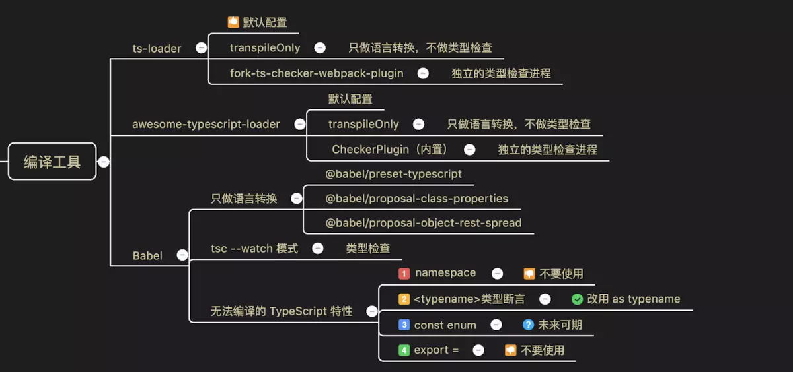

# 第一章 基础篇

> TS基础篇


## 一、基本类型

- `JavaScript` 的类型分为两种：原始数据类型和对象类型。
- 原始数据类型包括：布尔值、数值、字符串、`null`、`undefined` 以及 ES6 中的新类型 `Symbol`
- 本节主要介绍前五种原始数据类型在 `TypeScript` 中的应用。
- 布尔值是最基础的数据类型，在 `TypeScript` 中，使用 `boolean` 定义布尔值类型

**ES6数据类型**

- `Boolean`
- `Number`
- `String`
- `Array`
- `Function`
- `Object`
- `Symbol`
- `undefined`
- `null`

**Typescript数据类型**

- `Boolean`
- `Number`
- `String`
- `Array`
- `Function`
- `Object`
- `Symbol`
- `undefined`
- `null`
- `void`
- `any`
- `never`
- 元组
- 枚举
- 高级类型


**正确的写法**

```js
➖➖➖➖➖➖➖➖➖布尔➖➖➖➖➖➖➖➖➖
// 布尔值
let isDone: boolean = false;  

// 事实上 `new Boolean()` 返回的是一个 `Boolean` 对象
let createdByNewBoolean: Boolean = new Boolean(1);

//(直接调用 `Boolean` 也可以返回一个 `boolean` 类型) 
let createdByBoolean: boolean = Boolean(1); 

➖➖➖➖➖➖➖➖➖数值➖➖➖➖➖➖➖➖➖
// 数值
let decLiteral: number = 6;
let hexLiteral: number = 0xf00d;

// ES6 中的二进制表示法
let binaryLiteral: number = 0b1010;

// ES6 中的八进制表示法
let octalLiteral: number = 0o744;
let notANumber: number = NaN;
let infinityNumber: number = Infinity;
➖➖➖➖➖➖➖➖➖字符串➖➖➖➖➖➖➖➖➖
let myName: string = 'Tom';
➖➖➖➖➖➖➖➖➖空值➖➖➖➖➖➖➖➖➖
// 没有返回值的函数为void
function alertName(): void {
    alert('My name is Tom');
}

//声明一个 void 类型的只能将它赋值为 undefined 和 null
let unusable: void = undefined;
➖➖➖➖➖➖➖➖➖Null 和 Undefined➖➖➖➖➖➖➖➖➖
// undefined 类型的变量只能被赋值为 undefined，null 类型的变量只能被赋值为 null
let u: undefined = undefined;
let n: null = null;
```

**错误的写法**

> 注意:正确的很好记,大多数人都会写正确的,关键是要记住这些错误的!!!

```js
➖➖➖➖➖➖➖➖➖布尔➖➖➖➖➖➖➖➖➖
// 注意，使用构造函数 `Boolean` 创造的对象不是布尔值
let createdByNewBoolean: boolean = new Boolean(1);❌

➖➖➖➖➖➖➖➖➖数值➖➖➖➖➖➖➖➖➖
let decLiteral: number = "6";❌

➖➖➖➖➖➖➖➖➖字符串➖➖➖➖➖➖➖➖➖
let myName: string = 999;❌

➖➖➖➖➖➖➖➖➖空值➖➖➖➖➖➖➖➖➖
// 没有返回值的函数为void
function alertName(): void {❌
   return 666;
}
//声明一个 void 类型的只能将它赋值为 undefined 和 null
let unusable: void = 'I love you';❌

➖➖➖➖➖➖➖➖➖Null 和 Undefined➖➖➖➖➖➖➖➖➖
// undefined 类型的变量只能被赋值为 undefined，null 类型的变量只能被赋值为 null
let u: undefined = 888;❌
let n: null = 999;❌
```

## 二、任意值

**正确的写法**

```js
// 顾名思义,可以被任何值赋值
let anyThing: any = 'hello';
let anyThing: any = 888;
let anyThing: any = true;
let anyThing: any = null;
let anyThing: any = undefined;

// 变量如果在声明的时候，未指定其类型，那么它会被识别为任意值类型：
let any;
any =true;
```

## 三、类型推论

**正确的写法**

```js
// 如果没有明确的指定类型，那么 TypeScript 会依照类型推论（Type Inference）的规则推断出一个类型。
let myFavoriteNumber = 'seven';  
//等价于
let myFavoriteNumber :string= 'seven';
```

**错误的写法**

```js
// 第一句已经被推论为String类型了
let myFavoriteNumber = 'seven';
myFavoriteNumber = 7;❌
```

## 四、联合类型

**正确的写法**

```js
// 联合类型（Union Types）表示取值可以为多种类型中的一种。
// 当你允许某个变量被赋值多种类型的时候,使用联合类型,管道符进行连接
let myFavoriteNumber: string | number;
myFavoriteNumber = 'seven';
myFavoriteNumber = 7;

// 也可用于方法的参数定义, 都有toString方法,访问 string 和 number 的共有属性是没问题的
function getString(something: string | number): string {
    return something.toString();
}
```

**错误的写法**

```js
// number类型没有length属性.所以编译错误,因为我们只能访问此联合类型的所有类型里共有的属性或方法：
function getLength(something: string | number): number {❌
    return something.length;
}
```

## 五、对象的类型——接口

**正确的写法**

```js
// 赋值的时候，变量的形状必须和接口的形状保持一致(不能多也不能少,类型还必须一致)
interface Person {
    name: string;
    age: number;
}

let tom: Person = {
    name: 'Tom',
    age: 25
};


IUserInfo{
  age : any;//定义一个任何变量的 age.
  userName :string;//定义一个 username.
}
function getUserInfo(user : IUserInfo):string{
    return user.age+"======"+user.userName; 	
}
  ➖➖➖➖➖➖➖➖➖可选属性➖➖➖➖➖➖➖➖➖

interface Person {
    name: string;
    age?: number; // 表示这个属性可有可无
}

let tom: Person = {
    name: 'Tom'
};
// 可索引签名
interface StringArrary {
  [index]: string // 数字索引。通过数字索引，返回string类型
  [string]: string // 字符串索引签名。两者不能混用，一起使用的前提是数字索引是字符串索引的子集
}

let myArr: StringArrary
myArr = ['test1','test2']
let myString = myArr[0]


  ➖➖➖➖➖➖➖➖➖任意属性➖➖➖➖➖➖➖➖➖

//希望一个接口允许有任意的属性，可以使用如下方式：旦定义了任意属性，那么确定属性和可选属性的类型都必须是它的类型的子集
interface Person {
    name: string;
    age?: number;
    [propName: string]: any;
}

let tom: Person = {
    name: 'Tom',
    gender: 'male' // 可以加其他的属性
};

➖➖➖➖➖➖➖➖➖只读属性➖➖➖➖➖➖➖➖➖
interface Person {
    readonly id: number; // 
    name: string;
    age?: number;
    [propName: string]: any;
}

let tom: Person = {
    id: 89757, // 只读
    name: 'Tom',
    gender: 'male'
};
```

**错误的写法**

```js
// 一旦定义了任意属性，那么确定属性和可选属性的类型都必须是它的类型的子集
interface Person {
    name: string;
    age?: number;
    [propName: string]: string;
}

let tom: Person = {
    name: 'Tom',
    age: 25,
    gender: 'male'❌
};
上例中，任意属性的值允许是 string，但是可选属性 age 的值却是 number，number 不是 string 的子属性，所以报错了。

➖➖➖➖➖➖➖➖➖只读属性➖➖➖➖➖➖➖➖➖
interface Person {
    readonly id: number;
    name: string;
    age?: number;
    [propName: string]: any;
}

let tom: Person = {
    name: 'Tom',
    gender: 'male'
};

tom.id = 89757; // 不能被二次赋值❌
```

**数组只读属性**

```
let myARr:readonlyArrary<number> = [1,2,3]
```

## 六、数组的类型

**正确的做法**

```js
let fibonacci: number[] = [1, 1, 2, 3, 5];
let fibonacci: Array<number> = [1, 1, 2, 3, 5];

➖➖➖➖➖➖➖➖➖用接口表示数组➖➖➖➖➖➖➖➖➖
interface NumberArray {
    [index: number]: number;
}
let fibonacci: NumberArray = [1, 1, 2, 3, 5];

➖➖➖➖➖➖➖➖➖any 在数组中的应用➖➖➖➖➖➖➖➖➖
let list: any[] = ['Xcat Liu', 25, { website: 'http://xcatliu.com' }];

➖➖➖➖➖➖➖➖➖类数组➖➖➖➖➖➖➖➖➖
function sum() {
    let args: IArguments = arguments;
}
```

**错误的做法**

```js
// 数组的项中不允许出现其他的类型：
let fibonacci: number[] = [1, '1', 2, 3, 5];❌

// push 方法只允许传入 number 类型的参数，但是却传了一个 string 类型的参数，所以报错了。
let fibonacci: number[] = [1, 1, 2, 3, 5];
fibonacci.push('8');❌


// 类数组（Array-like Object）不是数组类型，比如 arguments
function sum() {❌
    let args: number[] = arguments;
}
```

## 七、函数的类型

**正确的做法**

```js
// 需要把输入和输出都考虑到
function sum(x: number, y: number): number {
    return x + y;
}

➖➖➖➖➖➖➖➖➖函数表达式➖➖➖➖➖➖➖➖➖
let mySum = function (x: number, y: number): number {
    return x + y;
};
// 不要混淆了 TypeScript 中的 => 和 ES6 中的 =>
let mySum: (x: number, y: number) => number = function (x: number, y: number): number {
    return x + y;
};
➖➖➖➖➖➖➖➖➖接口定义函数的形状➖➖➖➖➖➖➖➖➖
interface SearchFunc {
    (source: string, subString: string): boolean;
}

let mySearch: SearchFunc;
mySearch = function(source, subString) {
    return source.search(subString) !== -1;
}

➖➖➖➖➖➖➖➖➖可选参数➖➖➖➖➖➖➖➖➖
function buildName(firstName: string, lastName?: string) {
    if (lastName) {
        return firstName + ' ' + lastName;
    } else {
        return firstName;
    }
}
let tomcat = buildName('Tom', 'Cat');
let tom = buildName('Tom');


➖➖➖➖➖➖➖➖➖参数默认值➖➖➖➖➖➖➖➖➖
function buildName(firstName: string, lastName: string = 'Cat') {
    return firstName + ' ' + lastName;
}

➖➖➖➖➖➖➖➖➖剩余参数➖➖➖➖➖➖➖➖➖
// rest 参数只能是最后一个参数，关于 rest 参数,是一个数组
function push(array: any[], ...items: any[]) {
    items.forEach(function(item) {
        array.push(item);
    });
}

let a = [];
push(a, 1, 2, 3);
```

**错误的做法**

```js
// 输入多余的（或者少于要求的）参数，是不被允许的：
function sum(x: number, y: number): number {
    return x + y;
}
sum(1, 2, 3); ❌
sum(1);❌

// 输入多余的（或者少于要求的）参数，是不被允许的：
function sum(x: number, y: number): number {
    return x + y;
}
sum(1, 2, 3);

// 可选参数后面不允许再出现必须参数了：
function buildName(firstName?: string, lastName: string) {❌
    if (firstName) {
        return firstName + ' ' + lastName;
    } else {
        return lastName;
    }
}
let tomcat = buildName('Tom', 'Cat');
let tom = buildName(undefined, 'Tom');
```

### 7.1 函数相关知识点梳理

**四种声明方式：**

- 通过`function`
- 通过变量
- 通过接口
- 通过类型别名


```js
// 函数定义
function add1(x: number, y: number) {
    return x + y
}

// 通过变量
let add2: (x: number, y: number) => number

// 通过类型别名
let add3 = (x: number, y: number) => number

// 通过类型别名
interface add4 {
    (x: number, y: number): number
}
```

**用interface定义函数和用type定义函数有区别?**

- `type`：不是创建新的类型，只是为一个给定的类型起一个名字。`type`还可以进行联合、交叉等操作，引用起来更简洁
- `interface`：创建新的类型，接口之间还可以继承、声明合并
- 如果可能，建议优先使用 `interface`。
- 混合接口一般是为第三方类库写声明文件时会用到，很多类库名称可以直接当函数调用，也可以有些属性和方法。例子可以看一下`@types/jest/index.d.ts` 里面有一些混合接口。
- 用混合接口声明函数和用接口声明类的区别是，接口不能声明类的构造函数（既不带名称的函数），但混合接口可以，其他都一样。

**函数重载**

函数名相同，返回类型不同

```js
function add8(...rest: number[]): number;
function add8(...rest: string[]): string;
function add8(...rest: any[]): any {
    let first = rest[0];
    if(typeof first === 'string') {
        return rest.join('')
    }
    if(typeof first === 'number') {
        return rest.reduce((pre, cur) => pre + cur)
    }
}
```


## 八、类型断言

- 有时候你会遇到这样的情况，你会比 `TypeScript` 更了解某个值的详细信息。 通常这会发生在你清楚地知道一个实体具有比它现有类型更确切的类型。
- 通过类型断言这种方式可以告诉编译器，“相信我，我知道自己在干什么”。 类型断言好比其它语言里的类型转换，但是不进行特殊的数据检查和解构。 它没有运行时的影响，只是在编译阶段起作用。 `TypeScript` 会假设你，程序员，已经进行了必须的检查。

类型断言有两种形式。 其一是“尖括号”语法：

```js
let someValue: any = 'this is a string'

let strLength: number = (<string>someValue).length
```

> 另一个为 `as` 语法：

```js
let someValue: any = 'this is a string'

let strLength: number = (someValue as string).length
```

> 两种形式是等价的。 至于使用哪个大多数情况下是凭个人喜好；然而，当你在 `TypeScript` 里使用 `JSX` 时，只有` as` 语法断言是被允许


**正确的做法**

```js
// 可以使用类型断言，将 something 断言成 string
function getLength(something: string | number): number {
    if ((<string>something).length) {
        return (<string>something).length;
    } else {
        return something.toString().length;
    }
}
```

**错误的做法**

```js
// 只能访问此联合类型的所有类型里共有的属性或方法
function getLength(something: string | number): number { ❌
    return something.length;
}
```

## 九、类型别名

**正确的做法**

```js
// 使用 type 创建类型别名,类型别名常用于联合类型
type Name = string;
type NameResolver = () => string;
type NameOrResolver = Name | NameResolver;
function getName(n: NameOrResolver): Name {
    if (typeof n === 'string') {
        return n;
    } else {
        return n();
    }
}
```

## 十、枚举

**正确的做法**

```js
// 枚举（Enum）类型用于取值被限定在一定范围内的场景，比如一周只能有七天	
// 枚举就是枚举值到枚举名进行反向映射

enum Days {Sun, Mon, Tue, Wed, Thu, Fri, Sat};
console.log(Days["Sun"]); // 0
console.log(Days[0]); // 'Sun'

enum Days {Sun = 7, Mon = 1, Tue, Wed, Thu, Fri, Sat};
console.log(Days["Sun"]); // 7
```

## 十一、类

**正确的做法**

```js
➖➖➖➖➖➖➖➖➖类➖➖➖➖➖➖➖➖➖
class Animal {
    constructor(name) {
        this.name = name;
    }
    sayHi() {
        return `My name is ${this.name}`;
    }
}

let a = new Animal('Jack');
console.log(a.sayHi()); // My name is Jack
➖➖➖➖➖➖➖➖➖继承➖➖➖➖➖➖➖➖➖
class Cat extends Animal {
    constructor(name) {
        super(name); // 调用父类的 constructor(name)
        console.log(this.name);
    }
    sayHi() {
        return 'Meow, ' + super.sayHi(); // 调用父类的 sayHi()
    }
}

let c = new Cat('Tom'); // Tom
console.log(c.sayHi()); // Meow, My name is Tom
➖➖➖➖➖➖➖➖➖存储器➖➖➖➖➖➖➖➖➖
class Animal {
    constructor(name) {
        this.name = name;
    }
    get name() {
        return 'Jack';
    }
    set name(value) {
        console.log('setter: ' + value);
        this.name = value;
    }
}

let a = new Animal('Kitty'); // setter: Kitty
a.name = 'Tom'; // setter: Tom
console.log(a.name); // Jack
➖➖➖➖➖➖➖➖➖静态方法➖➖➖➖➖➖➖➖➖
class Animal {
    static isAnimal(a) {
        return a instanceof Animal;
    }
}

let a = new Animal('Jack');
Animal.isAnimal(a); // true
// 只能通过类名调用
a.isAnimal(a); // TypeError: a.isAnimal is not a function ❌
➖➖➖➖➖➖➖➖➖抽象类➖➖➖➖➖➖➖➖➖
// 只能被继承，不能被实例化
abstract class Animal {
  eat(){
    console.log('eat')
  }
  abstract sleep(): void
}
// 子类必须实现抽象类的抽象方法
class Dog extends Animal {
    constructor(name: string) {
        super()
        this.name = name
    }
    name: string;
    run() {}
    sleep() {
        console.log('dog sleep')
    }
}

let dog = new Dog('wang')
dog.eat()
```

### 11.1类与接口的关系

```js
interface Human {
    name: string;
    eat(): void;
}

// 实现接口中声明的属性
class Person implements Human {
    constructor(name: string) {
        this.name = name
    }
    name: string;
    eat() {}
}
```

```js
// 接口可以像类一样实现继承
interface Man extends Human {
    run(): voild
}
interface Child {
    cry(): voild
}
interface Boy extends Man,Child {}

// 添加被继承过来的属性
let body: Boy = {
    name: 'xx',
    run() {},
    eat() {},
    cry() {}
}
```

## 十二、public private 和 protected

- `public` 修饰的属性或方法是公有的，可以在任何地方被访问到，默认所有的属性和方法都是 `public` 的
- `private` 修饰的属性或方法是私有的，不能在声明它的类的外部访问
- `protected` 修饰的属性或方法是受保护的，它和 `private` 类似，区别是它在子类中也是允许被访问的

## 十三、泛型

> 更多详情 http://blog.poetries.top/ts-axios/chapter2/generic.html

> 泛型就是解决 类 接口 方法的复用性、以及对不特定数据类型的支持。**泛型理解为代表类型的参数，只是另一个维度的参数**

**正确的做法**

```js
//只能返回string类型的数据
function getData(value:string):string{
  return value;
}

//同时返回 string类型 和number类型  （代码冗余）
function getData1(value:string):string{
  return value;
}
function getData2(value:number):number{
  return value;
}

>>>>>>>>>>使用泛型后就可以解决这个问题
// T表示泛型，具体什么类型是调用这个方法的时候决定的
// 表示参数是什么类型就返回什么类型~~~
function getData<T>(value:T):T{
  return value;
}
getData<number>(123);
getData<string>('1214231');

// 定义接口
interface ConfigFn{
    <T>(value:T):T;
}
var getData:ConfigFn=function<T>(value:T):T{
  return value;
}
getData<string>('张三');
getData<string>(1243);  //错误
```

### 13.1 泛型函数和接口

```js
// 这两个等价的，使用时无需指定类型
type Log = <T>(value: T) => T;

// 只约束改成员
interface Log {
  <T>(value: T):T
}

// 这两个等价的，使用时必须指定类型
type Log<T> = (value: T) => T;

// 约束接口的所有成员
interface Log<T> {
  (value: T):T
}
```

### 13.2 泛型类与泛型约束

```js
// 把泛型放到类的后面，就可以约束所有成员
class Log<T> {
    run(value: T) {
        return value
    }
    // 不能约束静态成员
   // static eat() // 报错
}

// 实例化类 传入类型
let log1 = new Log<number>()
log1.run(1)

// 不指定类型参数传任意都允许
let log2 = new Log()
log2.run('1')
```

**类型约束**

```js
interface Length {
    length: number
}

// T继承了接口 约束了不是任意类型都可传。传入的参数必须有length属性
function log<T extends Length>(value: T): T {
    console.log(value, value.length)
    return value
}
// 如数组、字符串、对象都有length属性
log([1])
log('1')
log({a:1})
```

- 函数和类可以轻松支持多种类型，增强程序的扩展性
- 不必写多条函数重载
- 灵活控制类型之间的约束


**对象属性约束**

```js
// 泛型约束对象中的属性
function getProp<T,K extends keyof T>(obj:T,key: K) {
    return obj[key]
}
```


## 十四、类型检查机制

### 14.1 类型检查机制

> 编译器在做类型检查时，秉承的一些原则，表现出的一些行为

作用：辅助开发，提高开发效率

- 类型推断
- 类型兼容性
- 类型保护

> 所谓类型推断：不需要指定变量的类型（函数的返回值类型），TS可以根据某些规则自动的为其推断出一个类型

- 基础类型推断
- 最佳通用类型推断
- 上下文类型推断

> 基础类型推断，从右向左。但是有些是从左向右推断

如事件

```js
// ts 根据onkeydown推断出类型
window.onkeydown = event=>{
    console.log(event)
}
```

> 通过类型断言阻断TS的类型推断

```js
interface Foo {
    bar: number
}

//let foo = {} as Foo
//foo.bar = 1

let foo: Foo = {
    bar: 1
}
```

### 14.2 类型保护机制


> 联合类型适合于那些值可以为不同类型的情况。 但当我们想确切地了解是否为 Fish 或者是 Bird 时怎么办？ JavaScript 里常用来区分这 2 个可能值的方法是检查成员是否存在。如之前提及的，我们只能访问联合类型中共同拥有的成员


**不同的判断方法有不同的使用场景：**

- `typeof`：判断一个变量的类型
- `instanceof`：判断一个实例是否属于某个类
- `in`：判断一个属性是否属于某个对象
- 类型保护函数：某些判断可能不是一条语句能够搞定的，需要更多复杂的逻辑，适合封装到一个函数内

```js
function getLanguage(type: Type) {
    let lang = type === type.Strong ? new Java(): new Javascript()
    
    // 类型保护instanceof
    if(lang instanceof Java){
        lang.hellJava()
    }else {
        lang.hellJavaScript()
    }
    
    // in
    if('java' in lang) {
        lang.hellJava()
    }else {
        lang.hellJavaScript()
    }
    
    // 类型保护函数方式
    if(isJava(lang)) {
        lang.hellJava()
    }else {
        lang.hellJavaScript()
    }
}

// 创建一种类型保护函数
function isJava(lang: Java | Javascript): lang is Java {
    // 类型断言
    return (lang as Java).lang.helloJava !== undefined
}
```

```js
let pet = getSmallPet()

// 每一个成员访问都会报错
if (pet.swim) {
  pet.swim()
} else if (pet.fly) {
  pet.fly()
}
```

为了让这段代码工作，我们要使用类型断言

```js
let pet = getSmallPet()

if ((pet as Fish).swim) {
  (pet as Fish).swim()
} else {
  (pet as Bird).fly()
}
```

#### 14.2.1 用户自定义的类型保护

- 这里可以注意到我们不得不多次使用类型断言。如果我们一旦检查过类型，就能在之后的每个分支里清楚地知道 `pet` 的类型的话就好了。
- `TypeScript` 里的类型保护机制让它成为了现实。 类型保护就是一些表达式，它们会在运行时检查以确保在某个作用域里的类型。定义一个类型保护，我们只要简单地定义一个函数，它的返回值是一个类型谓词

```js
function isFish(pet: Fish | Bird): pet is Fish {
  return (pet as Fish).swim !== undefined
}
```

- 在这个例子里，`pet is Fish` 就是类型谓词。谓词为 `parameterName is Type` 这种形式， `parameterName` 必须是来自于当前函数签名里的一个参数名。
- 每当使用一些变量调用 `isFish` 时，TypeScript 会将变量缩减为那个具体的类型

```js
if (isFish(pet)) {
  pet.swim()
}
else {
  pet.fly()
}
```

> 注意 TypeScript 不仅知道在 `if` 分支里 `pet` 是 `Fish` 类型；它还清楚在` else` 分支里，一定不是 `Fish`类型而是 `Bird` 类型

#### 14.2.2 typeof 类型保护

我们可以像下面这样利用类型断言来写

```js
function isNumber (x: any):x is string {
  return typeof x === 'number'
}

function isString (x: any): x is string {
  return typeof x === 'string'
}

function padLeft (value: string, padding: string | number) {
  if (isNumber(padding)) {
    return Array(padding + 1).join(' ') + value
  }
  if (isString(padding)) {
    return padding + value
  }
  throw new Error(`Expected string or number, got '${padding}'.`)
}
```

> 然而，你必须要定义一个函数来判断类型是否是原始类型，但这并不必要。其实我们不必将 `typeof x === 'number'`抽象成一个函数，因为 TypeScript 可以将它识别为一个类型保护。 也就是说我们可以直接在代码里检查类型了

```js
function padLeft (value: string, padding: string | number) {
  if (typeof padding === 'number') {
    return Array(padding + 1).join(' ') + value
  }
  if (typeof padding === 'string') {
    return padding + value
  }
  throw new Error(`Expected string or number, got '${padding}'.`)
}
```

> 这些 `typeof` 类型保护只有两种形式能被识别：`typeof v === "typename"` 和 `typeof v !== "typename"`， `"typename"`必须是 `"number"`， `"string"`，`"boolean"` 或 `"symbol"`。 但是 TypeScript 并不会阻止你与其它字符串比较，只是 TypeScript 不会把那些表达式识别为类型保护。

#### 14.2.3 instanceof 类型保护

- 如果你已经阅读了 `typeof` 类型保护并且对 JavaScript 里的 `instanceof` 操作符熟悉的话，你可能已经猜到了这节要讲的内容。
- `instanceof` 类型保护是通过构造函数来细化类型的一种方式。我们把之前的例子做一个小小的改造：

```js
class Bird {
  fly () {
    console.log('bird fly')
  }

  layEggs () {
    console.log('bird lay eggs')
  }
}

class Fish {
  swim () {
    console.log('fish swim')
  }

  layEggs () {
    console.log('fish lay eggs')
  }
}

function getRandomPet () {
  return Math.random() > 0.5 ? new Bird() : new Fish()
}

let pet = getRandomPet()

if (pet instanceof Bird) {
  pet.fly()
}
if (pet instanceof Fish) {
  pet.swim()
}
```


## 十五、高级类型


### 15.1 交叉类型（取并集）

> 交叉类型是将多个类型合并为一个类型。这让我们可以把现有的多种类型叠加到一起成为一种类型，它包含了所需的所有类型的特性。 例如，`Person & Loggable` 同时是 `Person` 和 `Loggable`。就是说这个类型的对象同时拥有了这两种类型的成员。

> 我们大多是在混入（mixins）或其它不适合典型面向对象模型的地方看到交叉类型的使用。 （在 JavaScript里发生这种情况的场合很多！）下面是如何创建混入的一个简单例子

```js
function extend<T, U> (first: T, second: U): T & U {
  let result = {} as T & U
  for (let id in first) {
    result[id] = first[id] as any
  }
  for (let id in second) {
    if (!result.hasOwnProperty(id)) {
      result[id] = second[id] as any
    }
  }
  return result
}

class Person {
  constructor (public name: string) {
  }
}

interface Loggable {
  log (): void
}

class ConsoleLogger implements Loggable {
  log () {
    // ...
  }
}

var jim = extend(new Person('Jim'), new ConsoleLogger())
var n = jim.name
jim.log()
```


```js
interface DogInterface {
    run(): void
}
interface CatInterface {
    jump(): void
}

// pet 具备两个接口的所有方法
let pet: DogInterface & CatInterface = {
    run() {},
    jump() {}
}

// 联合类型
let a: number | string = 1
let b: 'a' | 'b' | 'c' // 字面量联合类型
let c: 1 | 2 | 3 // 数字联合类型


class Dog implements DogInterface {
    run() {}
    eat() {}
}
class Cat  implements CatInterface {
    jump() {}
    eat() {}
}
enum Master { Boy, Girl }
function getPet(master: Master) {
    let pet = master === Master.Boy ? new Dog() : new Cat();
    // pet.run()
    // pet.jump()
    pet.eat()
    return pet
}

interface Square {
    kind: "square";
    size: number;
}
interface Rectangle {
    kind: "rectangle";
    width: number;
    height: number;
}
interface Circle {
    kind: "circle";
    radius: number;
}

type Shape = Square | Rectangle | Circle

function area(s: Shape) {
    switch (s.kind) {
        case "square":
            return s.size * s.size;
        case "rectangle":
            return s.height * s.width;
        case 'circle':
            return Math.PI * s.radius ** 2
        default:
            return ((e: never) => {throw new Error(e)})(s)
    }
}
console.log(area({kind: 'circle', radius: 1}))
```

### 15.2 索引类型

```js
let obj = {
    a: 1,
    b: 2,
    c: 3
}

// function getValues(obj: any, keys: string[]) {
//     return keys.map(key => obj[key])
// }
function getValues<T, K extends keyof T>(obj: T, keys: K[]): T[K][] {
    return keys.map(key => obj[key])
}
console.log(getValues(obj, ['a', 'b']))
// console.log(getValues(obj, ['d', 'e']))

// keyof T
interface Obj {
    a: number;
    b: string;
}
let key: keyof Obj

// T[K]
let value: Obj['a']

// T extends U
```


### 15.3 映射类型

```js
interface Obj {
    a: string;
    b: number;
}

// 使得每个成员属性变为只读
type ReadonlyObj = Readonly<Obj>

// 把一个接口属性变为可选
type PartialObj = Partial<Obj>

// 抽取obj的子集
type PickObj = Pick<Obj, 'a' | 'b'>

type RecordObj = Record<'x' | 'y', Obj>
```

### 15.4 条件类型

```js
// T extends U ? X : Y

type TypeName<T> =
    T extends string ? "string" :
    T extends number ? "number" :
    T extends boolean ? "boolean" :
    T extends undefined ? "undefined" :
    T extends Function ? "function" :
    "object";
type T1 = TypeName<string>
type T2 = TypeName<string[]>

// (A | B) extends U ? X : Y
// (A extends U ? X : Y) | (B extends U ? X : Y)
type T3 = TypeName<string | string[]>

type Diff<T, U> = T extends U ? never : T
type T4 = Diff<"a" | "b" | "c", "a" | "e">
// Diff<"a", "a" | "e"> | Diff<"b", "a" | "e"> | Diff<"c", "a" | "e">
// never | "b" | "c"
// "b" | "c"

type NotNull<T> = Diff<T, null | undefined>
type T5 = NotNull<string | number | undefined | null>

// Exclude<T, U>
// NonNullable<T>

// Extract<T, U>
type T6 = Extract<"a" | "b" | "c", "a" | "e">

// ReturnType<T>
type T8 = ReturnType<() => string>
```

### 15.5 联合类型

> 联合类型与交叉类型很有关联，但是使用上却完全不同。 偶尔你会遇到这种情况，一个代码库希望传入 `number` 或 `string` 类型的参数。 例如下面的函数

```js
function padLeft(value: string, padding: any) {
  if (typeof padding === 'number') {
    return Array(padding + 1).join(' ') + value
  }
  if (typeof padding === 'string') {
    return padding + value
  }
  throw new Error(`Expected string or number, got '${padding}'.`)
}

padLeft('Hello world', 4) // returns "    Hello world"
```

> padLeft 存在一个问题，padding 参数的类型指定成了 any。 这就是说我们可以传入一个既不是 number 也不是 string 类型的参数，但是 TypeScript 却不报错

```js
let indentedString = padLeft('Hello world', true) // 编译阶段通过，运行时报错
```

> 为了解决这个问题，我们可以使用 联合类型做为 `padding` 的参数

```js
function padLeft(value: string, padding: string | number) {
  // ...
}

let indentedString = padLeft('Hello world', true) // 编译阶段报错
```

- 联合类型表示一个值可以是几种类型之一。我们用竖线（`|`）分隔每个类型，所以 `number | string` 表示一个值可以是 `number `或` string`。

> 如果一个值是联合类型，**我们只能访问此联合类型的所有类型里共有的成员**

```js
interface Bird {
  fly()
  layEggs()
}

interface Fish {
  swim()
  layEggs()
}

function getSmallPet(): Fish | Bird {
  // ...
}

let pet = getSmallPet()
pet.layEggs() // okay
pet.swim()    // error
```

> 这里的联合类型可能有点复杂：如果一个值的类型是 `A | B`，我们能够确定的是它包含了 `A` 和 `B` 中共有的成员。这个例子里，Fish 具有一个 `swim` 方法，我们不能确定一个 `Bird | Fish`类型的变量是否有 `swim`方法。 如果变量在运行时是 Bird 类型，那么调用 `pet.swim() `就出错了


## 十六、初学者的困惑

### 16.1 如何优雅的声明类型

#### 16.1.1 基础

```js
interface Basic {
  num: number;
  str: string | null;
  bol?: boolean;
}
```

> 五种 JS 值类型就声明好了。那数组、函数呢？

```js
interface Func {
  func(str: string): void;
}

interface Arr {
  str: string[];
  mixed: Array<string | number>;
  fixedStructure: [string, number];
  basics: Basic[];
}
```

> 枚举类型也是很常用的，比如声明一个状态机的各个状态

```js
enum Status {
  Draft,
  Published
}

// 也可指定值
enum Status {
  Draft = 'Draft',
  Published = 'Published'
}
```

#### 16.1.2 糅合

**独立声明**

> 一个 `ts` 文件只声明一个类型或者接口，文件名为需要暴露的类型名称，方便检索和管理

**就近声明**

> 当一个声明没有被外部引用或者依赖时，可以考虑就近放在使用的地方，典型的场景是 `React` 组件的 `Props` 和 `State` 的类型声明

**按职责分组**

- 在项目中，需要声明类型的可大致分为两类：一类是 `model`，也就是接口请求相关的，包括入参和出参；另一类是 `view`，界面渲染相关的。因此，我在 独立声明 的基础上，可以类型按照`model` 和 `view` 的维度进行分组，相互独立。
- 那么问题来了，如果是独立的类型声明的话，怎么把 model 的数据应用到 `view` 呢？ 可能你需要一个 `adapter` 来做类型的的转换：`DTOTypes` -> `adapter` -> `ViewTypes`, 完成类似于将接口中的字符串映射成枚举类型这之类的转换

**any**

> 当遇到确实解决不了的类型报错的时候，`as any` 能带给你不一样的快感，但是不建议使用啊


### 16.2 如何引用外部库

> 在 `JS` 中，`npm` 上有丰富的海量的库帮我们完成日常的编码，可能并不是所有的库都能完全被应用到 `TS` 中，因为有些缺少类型声明

比如，在 `TS` 中使用 `react `, 你会得到这样的一个类型检查错误：


- 因为 react 的库中并没有类型声明
- 现在比较通用的做法是，实现和类型实现独立成两个库，也就是你需要再安装类型声明的库: `@types/react`
- 当遇到上述问题的时候，尝试安装一下 `@types/[package]`
- 然而，并不是所有的库都有类型声明的实现，也会有很多不支持 TS 的存在，然而又必须得使用这个库的时候该怎么办？

**自己写声明**

> 以 `progressbar.js`为例，基本使用方法

```js
import * as ProgressBar from 'progressbar.js';

new ProgressBar.Circle(this.$progress, {
  strokeWidth: 8,
  trailColor: '#e5e4e5',
  trailWidth: 8,
  easing: 'easeInOut'
});
```

我们需要对库中暴露出的 api 去做声明，对上述例子做个分解：暴露了 Circle 类，Circle 构造函数包含两个参数，一个 HTMLElement，一个 options. OK

```js
// 首先声明一下模块：
declare module 'progressbar.js' {
  // 模块中暴露了 Circle 类
  export class Circle {
    constructor(container: HTMLElement, options: Options);
  }

  // 构造函数的 Options 需要单独声明 
  interface Options {
    easing?: string;
    strokeWidth?: number;
    trailColor?: string;
    trailWidth?: number;
  }
}
```

> 如此我们便完成了一个简单的声明，当然实际使用中的 API 肯定比上述情况复杂，根据使用情况，用了哪些 API 或者参数，就补充那些的声明即可

### 16.3 如何组织一个 TS 项目

- TS 项目的目录组织上，跟 JS 项目一样，补充好 types 的声明就可以了
- 需要注意的是，将你希望对外暴露的能力相关的类型声明都暴露出去，不友好的声明会让接入你项目的人非常的痛苦，同时，在 package.json 中需要指定 type 的 path, 比如："types": "dist/types/index.d.ts"
- 另外，务必加上 tslint, 更规范的去用 TS 实现功能，对于入门而言尤为重要

### 16.4 TSX 和 JSX

- 之前我们在用 `JavaScript` 写 `React` 时，对文件的扩展名没有什么特别的要求，`.js` 或者 `.jsx` 都行。
- 但在 `TypeScript` 中，如果你要使用 `JSX` 语法，就不能使用 `.ts`，必须使用 `.tsx`。如果你不知道，或者忘了这么做，那么你会在使用了 `JSX` 代码的地方收到类型报错，但代码本身怎么看都没有问题。这也是刚上手 `TypeScript + React` 时几乎每个人都会遇到的坑。
- 关于这一点，`TypeScript` 只是在官方教程的示例代码中直接用了 `*.tsx`，但并没有明确说明这一问题

### 16.5 变量的 Type 怎么找

- 上手 `TypeScript` 之后很快我们就发现，即便是原生的 `DOM`、或是 `React` 的 `API`，也经常会要我们手动指定类型。但这些结构并不是简单的 `JavaScript `原始类型，在使用 `JavaScript` 编写相关代码时候由于没有这种需要，我们也没关心过这些东西的类型，突然问起来，还真不知道这些类型叫什么名字。
- 不光是这些标准类型，同样的问题在很多第三方的库中也会遇到，比如一些组件库会检查你传入的 `Props`
- 在我看来，这中间其实缺少了一部分的文档，来指导新用户如何找到所需要的类型。既然社区没有提供，那就我来吧。
- 当然，让每个开发者都熟记所有的类型肯定是不现实的，总不能每接触一个新的库，就要去记一堆类型吧。放心，世界还是美好的，这种事情，当然是有方法的。
- 最直白的方法就是去看库的 `Types Definition`，也就是那些 `.*d.ts` 文件。如果你刚好有在用 `VS Code` 的话，有一个非常方便的操作：把鼠标移动到你想知道它类型的代码上（比如某个变量、某个函数调用，或是某个 JSX 标签、某个组件的 props），右键选择「Go to Definition」（或者光标选中后按 F12），就可以跳转到它的类型定义文件了。
- 如果你更习惯使用 VS Code 之外的编辑器，我相信时至今日，它们应该也都早就对 `TypeScript` 提供了支持。具体操作我不太熟悉，你可以自己探索下（我一直用 VS Code，其它的不太熟）
- 一般来说，这个操作可以直接把你带到你想要的地方，但考虑到类型是可以继承的，有时候一次跳转可能不太够，遇到这种情况，那就需要你随机应变一下，沿着继承关系多跳几次，直到找到你想要的内容。
- 对于不熟悉的类型，可以通过这个方法去寻找，慢慢熟悉以后，你会发现，一些常见的类型还是很好找的，稍微联想一下英文的表达方式，配合自动补全的提示，一般都不难找到

### 16.6 常见 Types 之 DOM

- `TypeScript` 自带了一些基本的类型定义，包括 ECMAScript 和 DOM 的类型定义，所有你需要的类型都可以从这里找到。如果你想做一些「纯 TypeScript 开发」的话，有这些就够了
- 比如下面这张截图，就是对 `<div>` 标签的类型定义。我们可以看到，它继承了更加通用的 `HTMLElement` 类型，并且扩展了一个即将被废弃的 `align` 属性，以及两组 `addEventListener` 和 `removeEventListener`，注意这里使用了重载。


> 这里的命名也不是随便起的，都是在 MDN 上可以查到的。还是以 `<div>` 为例，我们已经知道它继承自 `HTMLElement`，其实再往上，`HTMLElement` 继承自 `Element`，`Element` 又继承自 `Node`，顺着这条路，你可以挖掘出所有 `HTML` 标签的类型


> 对于一些 DOM 相关的属性，比如 `onclick`、`onchange` 等，你都可以如法炮制，找到它们的定义。

### 16.7 常见 Types 之 React

- 关于 TypeScript 的问题，有不少其实是在使用第三方库的时候遇到的，React 就是其中比较典型的一个
- 其实方法都一样，只不过相关的类型定义不在 `TypeScript` 中，而是在 `@types/react` 中。
- `React` 的类型定义的名称其实也很直观，比如我们常见的 `React.Component`，在定义 `Class` 组件时，我们需要对 `Props` 和 `State` 预先进行类型定义，为什么呢？答案就在它的类型定义中


- 再比如，当我们在写一些组件时，我们可能会需要向下传递 `this.props.children`，但 `children` 并没有被设为默认值，需要我们自己定义到 `props` 上，那么它的类型应该是什么呢
- 到类型定义中搜一下关键字 `children`，很快我们就找到了下面的定义


> 所有 `React` 中 `JSX` 所代表的内容，无论是 `render()` 的返回，还是 `children`，我们都可以定义为一个 `ReactNode`。那这个 `ReactNode` 长什么样呢？我们通过右键继续寻找


> 看到这里，我们不光找到了我们想要的类型，还顺带明白了为什么 `render()` 可以返回 `boolean`、`null`、`undefined` 表示不渲染任何内容。
那么事件呢？当我们给组件定义事件处理函数的时候，也经常会被要求指定类型。还是老办法，找不到咱就搜，比如 `onClick` 不清楚，那我们就以它为关键字去搜


> 据此我们找到一个叫 `MouseEventHandler` 的定义，这名字，够直白吧。好了，我们找到想要的了。不过既然来了，不如继续看一下，看看还能发现什么。我们右键 `MouseEventHandler` 急需往下看：


> 看到了吗，所有的事件处理函数都有对应的定义，每个都需要一个泛型参数，传递了事件的类型，名称也挺直白的


> 事件的类型也被我们挖出来了，以后如果需要单独定义一个事件相关的类型，就可以直接用了。以此类推，不管是什么东西的类型，都可以去它们对应的 `@types/xxx `里，按关键字搜

### 16.8 多重 extends

- 我们知道 `Interface` 是可以多继承的，`extends` 后面可以跟多个其它 `Interface`，我们不能保证被继承的多个 `Interface` 一定没有重复的属性，那么当属性重复，但类型定义不同时，最终的结果会怎么样呢？
- 在 `TypeScript` 中，`Interface` 会按照从右往左的顺序去合并多个被继承的 `Interface`，也就是说，同名属性，左边的会覆盖右边的

```js
interface A {
  value?: string
}
interface B {
  value: string
}
interface C {
  value: number
}
interface D extends A, B {}// value?: string
interface E extends B, C {}// value: string
```

### 16.9 obj[prop] 无法访问怎么办

- 有时候我们会定义一些集合型的数据，例如对象、枚举等，但在调用的时候，我们未必会直接通过 `obj.prop` 的形式去调用，可能会是以 `obj[prop]` 这种动态索引的形式去访问，但通过动态索引的方式就无法确定最终访问的元素是否存在，因此在 `TypeScript` 中，默认是不允许这种操作的
- 但这又是个非常合理，而且非常常见的场景，怎么办呢？`TypeScript` 允许为类型添加索引，以实现这一点。

```js
interface Foo {
  x: string,
  y: number
  [index: string]: string | number
}
```

- 这个方法虽然有效，但每次都要手动为类型加索引，重复多了也挺心累的。包括在一些「配置对象」中，我们甚至无法确定有哪些类型，有没有一种更加通用、更加一劳永逸的方法。
- 其实在 `TypeScript `的官方文档中就有提到这个方案，官方管它叫 `OptionBag`，大概就是指 `config`、o`ption` 等用于提供配置信息的这么一类参数。我不是很确定这到底是个常规的英文单词，还是 `TypeScript` 中特定的术语（个人感觉是前者），反正就这么个意思吧。
简单说来，我们可以定义下面这样一个类型：

```js
interface OptionBag {
  [index: string]: any
}
```

- 这是一个非常通用的结构，以字符串为键，值可以是任何类型，并且支持索引 —— 这不就是 `Object` 么。
- 之后所有需要动态索引的结构，或是作为配置对象的结构，都可以直接指定为，或是继承 `OptionBag`。这个方案以牺牲一定的类型检查为代价，换取了操作上的便利。
- 理论上讲，`OptionBag` 可以适用于所有类似对象这样的结构，但不建议各位真就这么做。这个方案只能是用在一些对类型要求不那么严格，或是无法预知类型的场景中，能够确定的类型还是尽可能地写一下，否则就失去了使用 `TypeScript` 意义了


## 十七、其他技巧

**1. 安全导航操作符 ( ?. )和非空断言操作符（!.）**

- **安全导航操作符 ( ?. ) 和空属性路径**： 

> 为了解决导航时变量值为null时，页面运行时出错的问题

- **非空断言操作符**

> 能确定变量值一定不为空时使用。与安全导航操作符不同的是，非空断言操作符不会防止出现 `null` 或 `undefined`

```
let s = e!.name; // 断言e是非空并访问name属性
```


# 第二章 工程篇





## 一、使用命名空间

> 不要在一个模块中使用命名空间，最好在一个全局中使用

```js
// a.ts
namespace Shape {
    const pi = Math.PI
    export function cricle(r: number) {
        return pi * r ** 2
    }
}
```

```js
// b.ts

// 三斜线引用a
/// <reference path="a.ts" />
namespace Shape {
    export function square(x: number) {
        return x * x
    }
}

console.log(Shape.cricle(2))
console.log(Shape.square(2))

// 更方便使用 不是es6中的import
import cricle = Shape.cricle
console.log(cricle(2))
```

## 二、理解联合声明

```js
// 接口声明合并
interface A {
    x: number;
    // y: string;
    foo(bar: number): number; // 5
    foo(bar: 'a'): string; // 2
}

interface A {
    y: number;
    foo(bar: string): string; // 3
    foo(bar: string[]): string[]; // 4
    foo(bar: 'b'): string; // 1
}

let a: A = {
    x: 1,
    y: 2,
    foo(bar: any) {
        return bar
    }
}

// 命名空间和类声明合并--命名空间需要放到后面
class C {}
namespace C {
    export let state = 1
}
console.log(C.state)

// 命名空间和函数声明合并--命名空间需要放到后面
function Lib() {}
namespace Lib {
    export let version = '1.0'
}
console.log(Lib.version)

// 命名空间和枚举声明合并--位置没有要求
enum Color {
    Red,
    Yellow,
    Blue
}
namespace Color {
    export function mix() {}
}
console.log(Color)
```

## 三、如何编写声明文件--引入类库

> 类库分为三类：全局类库、模块类库、`UMD`类库

```js
declare var // 声明全局变量
declare function // 声明全局方法
declare class // 声明全局类
declare enum // 声明全局枚举类型
declare global // 扩展全局变量
declare module // 扩展模块
```

> 大多数的声明文件社区已经帮我们安装好了，使用`@types/包名`声明文件即可

> Typescript声明文件查找 https://microsoft.github.io/TypeSearch/

**以jquery为例子**

```
yarn add @types/jquery 
```


**引入了一个JS类库，但是社区又没有提供类型声明文件，我该如何去编写它的类型声明文件**

> 先确定这个库的类型，全局库、模块库、还是UMD库，然后参照下面介绍的方法，把它的`API`声明逐步添加进来（暂时用不到的`API`也可以不写）

### 3.1 三种类库声明文件写法

#### 3.1.1 全局库

```js
// global-lib.d.ts
    
declare function globalLib(options: globalLib.Options): void;
// 函数和命名空间的声明合并 为这个函数提供了一些属性
declare namespace globalLib {
    const version: string;
    function doSomething(): void;
    interface Options {
        [key: string]: any
    }
}
```

```js
// global-lib.js
// 和声明文件对应
function globalLib(options) {
    console.log(options);
}

globalLib.version = '1.0.0';

globalLib.doSomething = function() {
    console.log('globalLib do something');
};
```

```js
// 全局使用 index.ts
globalLib({x:1})
globalLib.doSomething()
```

#### 3.1.2 模块类库

```js
// module-lib.d.ts
declare function moduleLib(options: Options): void

interface Options {
    [key: string]: any
}

declare namespace moduleLib {
    const version: string
    function doSomething(): void
}

export = moduleLib
```

```js
// module-lib.js
const version = '1.0.0';

function doSomething() {
    console.log('moduleLib do something');
}

function moduleLib(options) {
    console.log(options);
}

moduleLib.version = version;
moduleLib.doSomething = doSomething;

module.exports = moduleLib;
```

```js
// index.ts 使用
import umdLib from './umd-lib'

umdLib.doSomething()
```


#### 3.1.3 UMD类库

```js
// umd-lib.d.ts

declare namespace umdLib {
    // 省略了export
    const version: string
    function doSomething(): void
}

// UMD库不可缺少的语句
export as namespace umdLib

export = umdLib
```

```js
// umd-lib.js
(function (root, factory) {
    if (typeof define === "function" && define.amd) {
        define(factory);
    } else if (typeof module === "object" && module.exports) {
        module.exports = factory();
    } else {
        root.umdLib = factory();
    }
}(this, function() {
    return {
        // 需要为这两个成员编写声明文件
        version: '1.0.0',
        doSomething() {
            console.log('umdLib do something');
        }
    }
}))
```

```js
// index.ts使用
import umdLib from './umd-lib'
// 可以不用导入umd-lib模块。但是需要打开tsconfig.tson中的umd配置
umdLib.doSomething()
```

### 3.2 两种插件声明文件写法


#### 3.2.1 模块化插件declare module


> `declare module` 可以给类库添加一些自定义方法。 扩展模块


```js
// 模块插件
import m from 'moment';
declare module 'moment' {
    // 给moment自定义一些方法
    export function myFunction(): void;
}
m.myFunction = () => {}
```

#### 3.2.2 全局插件declare global

```js
// 全局插件
declare global {
    namespace globalLib {
        function doAnyting(): void
    }
}
// 在全局变量添加方法
// 会对全局变量造成污染 一般不这么做
globalLib.doAnyting = () => {}
```


### 3.3 jquery声明文件示例

```js
// index.d.ts入口

// Type definitions for jquery 3.3
// Project: https://jquery.com
// Definitions by: Leonard Thieu <https://github.com/leonard-thieu>
//                 Boris Yankov <https://github.com/borisyankov>
//                 Christian Hoffmeister <https://github.com/choffmeister>
//                 Steve Fenton <https://github.com/Steve-Fenton>
//                 Diullei Gomes <https://github.com/Diullei>
//                 Tass Iliopoulos <https://github.com/tasoili>
//                 Jason Swearingen <https://github.com/jasons-novaleaf>
//                 Sean Hill <https://github.com/seanski>
//                 Guus Goossens <https://github.com/Guuz>
//                 Kelly Summerlin <https://github.com/ksummerlin>
//                 Basarat Ali Syed <https://github.com/basarat>
//                 Nicholas Wolverson <https://github.com/nwolverson>
//                 Derek Cicerone <https://github.com/derekcicerone>
//                 Andrew Gaspar <https://github.com/AndrewGaspar>
//                 Seikichi Kondo <https://github.com/seikichi>
//                 Benjamin Jackman <https://github.com/benjaminjackman>
//                 Poul Sorensen <https://github.com/s093294>
//                 Josh Strobl <https://github.com/JoshStrobl>
//                 John Reilly <https://github.com/johnnyreilly>
//                 Dick van den Brink <https://github.com/DickvdBrink>
//                 Thomas Schulz <https://github.com/King2500>
//                 Terry Mun <https://github.com/terrymun>
// Definitions: https://github.com/DefinitelyTyped/DefinitelyTyped
// TypeScript Version: 2.3

// 三斜线引入模块

/// <reference types="sizzle" />
/// <reference path="JQueryStatic.d.ts" />
/// <reference path="JQuery.d.ts" />
/// <reference path="misc.d.ts" />
/// <reference path="legacy.d.ts" />

export = jQuery;
```


## 四、配置tsconfig.json

### 4.1 基础配置

```js
{
  // ===与文件相关的选项===
  "files" : ['src/index.ts'], // 编译的文件列表
  "include": ['src'], // 指定编译文件
  "exclude": ['src/lib'], // 排除编译文件
  
  // ====与编译相关的选项====
  "compilerOptions": {
      // "incremental": true,                // 增量编译，再次编译会增量编译
      // "tsBuildInfoFile": "./buildFile",   // 增量编译文件的存储位置
      // "diagnostics": true,                // 打印诊断信息

      // "target": "es5",           // 目标语言的版本
      // "module": "commonjs",      // 生成代码的模块标准
      // "outFile": "./app.js",     // 将多个相互依赖的文件生成一个文件，可以用在 AMD 模块中
        
       // 比如你需要使用es2019方法 需要在这里导入模块 "lib": ['es2019.arrary']
      // "lib": [],                 // TS 需要引用的库，即声明文件，es5 默认 "dom", "es5", "scripthost"

      // "allowJs": true,           // 允许编译 JS 文件（js、jsx）
      // "checkJs": true,           // 允许在 JS 文件中报错，通常与 allowJS 一起使用
      // "outDir": "./out",         // 指定输出目录
      // "rootDir": "./",           // 指定输入文件目录（用于输出）

      // "declaration": true,         // 生成声明文件
      // "declarationDir": "./d",     // 声明文件的路径
      // "emitDeclarationOnly": true, // 只生成声明文件
      // "sourceMap": true,           // 生成目标文件的 sourceMap
      // "inlineSourceMap": true,     // 生成目标文件的 inline sourceMap
      // "declarationMap": true,      // 生成声明文件的 sourceMap
      // "typeRoots": [],             // 声明文件目录，默认 node_modules/@types
      // "types": [],                 // 声明文件包

      // "removeComments": true,    // 删除注释

      // "noEmit": true,            // 不输出文件
      // "noEmitOnError": true,     // 发生错误时不输出文件

      // "noEmitHelpers": true,     // 不生成 helper 函数，需额外安装 ts-helpers
      // "importHelpers": true,     // 通过 tslib 引入 helper 函数，文件必须是模块

      // "downlevelIteration": true,    // 降级遍历器的实现（es3/5）

      // "strict": true,                        // 开启所有严格的类型检查
      // "alwaysStrict": false,                 // 在代码中注入 "use strict";
      // "noImplicitAny": false,                // 不允许隐式的 any 类型
      // "strictNullChecks": false,             // 不允许把 null、undefined 赋值给其他类型变量
      // "strictFunctionTypes": false           // 不允许函数参数双向协变
      // "strictPropertyInitialization": false, // 类的实例属性必须初始化
      // "strictBindCallApply": false,          // 严格的 bind/call/apply 检查
      // "noImplicitThis": false,               // 不允许 this 有隐式的 any 类型

      // "noUnusedLocals": true,                // 检查只声明，未使用的局部变量
      // "noUnusedParameters": true,            // 检查未使用的函数参数
      // "noFallthroughCasesInSwitch": true,    // 防止 switch 语句贯穿
      // "noImplicitReturns": true,             // 每个分支都要有返回值

      // "esModuleInterop": true,               // 允许 export = 导出，由import from 导入
      // "allowUmdGlobalAccess": true,          // 允许在模块中访问 UMD 全局变量
      // "moduleResolution": "node",            // 模块解析策略
      // "baseUrl": "./",                       // 解析非相对模块的基地址
      // "paths": {                             // 路径映射，相对于 baseUrl
      //   "jquery": ["node_modules/jquery/dist/jquery.slim.min.js"]
      // },
      // "rootDirs": ["src", "out"],            // 将多个目录放在一个虚拟目录下，用于运行时

      // "listEmittedFiles": true,        // 打印输出的文件
      // "listFiles": true,               // 打印编译的文件（包括引用的声明文件）
  }
}
```

> 也可以把公共的抽离出来

```js
// tsconfig.base.json

{
  "files" : ['src/index.ts'], // 编译的文件列表
  "include": ['src'], // 指定编译文件
  "exclude": ['src/lib'], // 排除编译文件
}
```

```js
"extends": './tsconfig.base',
"exclude": [] // 覆盖之前的
```

### 4.2 工程引用配置多个项目

> 每个项目都有一份独立的`tsconfig.json`，继承一份公共的配置，最后可单独构建每个子项目工程

> 参考学习`typescript`项目 https://github.com/microsoft/TypeScript/tree/master/src

```js
// 示例 项目入口
{
  "compilerOptions": {
    "target": "es5",
    "module": "commonjs",
    "strict": true,
    "composite": true,
    "declaration": true
  }
}
```

```js
// 子工程1
// src/client/tsconfig.json
{
    "extends": "../../tsconfig.json", //继承基础配置
    "compilerOptions": {
        "outDir": "../../dist/client", // 输出文件
    },
    "references": [
        { "path": "../common" } // 依赖文件
    ]
}

```

```js
// 子工程2
// src/server/tsconfig.json

{
    "extends": "../../tsconfig.json",
    "compilerOptions": {
        "outDir": "../../dist/server",
    },
    "references": [
        { "path": "../common" }
    ]
}
```


## 五、编译工具ts-loader、ts-lint

**如何选择Typescript编译器**

> - 如果没有使用过`babel`，首选`Typescript`自身编译器(可配合`Ts-loader`使用)
> - 如果项目中已经使用`babel`，安装`@babel/preset-typescript`(可配合tsc做类型检查)
> - 两种编译工具不要混用

**typescript-eslint与babel-eslint区别**

> - `babel-eslint`支持`typescript`没有额外的语法检查，抛弃`typescript`,不支持类型检查
> - `typescript-eslint`基础typescript的AST,基于创建基于类型信息的规则（`tsconfig.json`）

- 两者底层机制不一样，不要一起使用
- `babel`体系建议使用`babel-eslint`，否则使用`typescript-eslint`

**总结**

- 编译工具
  - `ts-loader`
  - `@babel/preset-typescript`

- 代码检查工具
  - `babel-eslint`
  - `typescript-eslint`

## 六、使用jest进行单元测试

- 单元测试工具
  - `ts-jest` -- 能够在测试用例中进行类型检查
  - `babel-jest` -- 没有进行类型检查
  
> 生成配置文件 `ts-jest config:init`


# 第三章 项目实战

## 一、思维导图


## 二、React项目实践

### 2.1 手动创建react项目

> 项目代码 https://github.com/poetries/typescript-in-action/tree/master/ts-react

**1. 安装依赖文件**

```js
yarn add @types/react @types/react-dom
```

**2. 修改tsconfig.json**配置

> 修改 `compilerOptions`中的`jsx`为`react`

### 2.2 使用脚手架安装

> 项目代码 https://github.com/poetries/typescript-in-action/tree/master/ts-react-app

```
create-react-app ts-react-app --typescript
```

#### 2.2.1 函数组件

```js
import React from 'react';
import { Button } from 'antd';

interface Greeting {
    name: string;
    firstName: string;
    lastName: string;
}

const Hello = (props: Greeting) => <Button>Hello {props.name}</Button>

// const Hello: React.FC<Greeting> = ({
//     name,
//     firstName,
//     lastName,
//     children
// }) => <Button>Hello {name}</Button>

Hello.defaultProps = {
    firstName: '',
    lastName: ''
}

export default Hello;
```

#### 2.2.2 类组件

```js
import React, { Component } from 'react';
import { Button } from 'antd';

interface Greeting {
    name: string;
    firstName?: string;
    lastName?: string;
}

interface HelloState {
    count: number
}

class HelloClass extends Component<Greeting, HelloState> {
    state: HelloState = {
        count: 0
    }
    static defaultProps = {
        firstName: '',
        lastName: ''
    }
    render() {
        return (
            <>
                <p>你点击了 {this.state.count} 次</p>
                <Button onClick={() => {this.setState({count: this.state.count + 1})}}>
                    Hello {this.props.name}
                </Button>
            </>
        )
    }
}

export default HelloClass;
```

#### 2.2.3 高阶组件

```js
import React, { Component } from 'react';

import HelloClass from './HelloClass';

interface Loading {
    loading: boolean
}

function HelloHOC<P>(WrappedComponent: React.ComponentType<P>) {
    return class extends Component<P & Loading> {
        render() {
            const { loading, ...props } = this.props;
            return loading ? <div>Loading...</div> : <WrappedComponent { ...props as P } />;
        }
    }
}

export default HelloHOC(HelloClass);
```

#### 2.2.4 Hooks组件

```js
import React, { useState, useEffect } from 'react';
import { Button } from 'antd';

interface Greeting {
    name: string;
    firstName: string;
    lastName: string;
}

const HelloHooks = (props: Greeting) => {
    const [count, setCount] = useState(0);
    const [text, setText] = useState<string | null>(null);

    useEffect(() => {
        if (count > 5) {
            setText('休息一下');
        }
    }, [count]);

    return (
        <>
            <p>你点击了 {count} 次 {text}</p>
            <Button onClick={() => {setCount(count + 1)}}>
                Hello {props.name}
            </Button>
        </>
    )
}

HelloHooks.defaultProps = {
    firstName: '',
    lastName: ''
}

export default HelloHooks;
```

#### 2.2.5 事件处理与数据请求


```js
import React, { Component, useState, useEffect } from 'react';
import { Form, Input, Select, Button } from 'antd';
import { FormComponentProps } from 'antd/lib/form';

import { get } from '../../utils/request';
import { GET_EMPLOYEE_URL } from '../../constants/urls';
import { EmployeeRequest, EmployeeResponse } from '../../interface/employee';

const { Option } = Select;

interface Props extends FormComponentProps {
    onDataChange(data: EmployeeResponse): void
}

// Hooks version
// const QueryFormHooks = (props: Props) => {
//     const [name, setName] = useState('');
//     const [departmentId, setDepartmentId] = useState<number | undefined>();

//     const handleNameChange = (e: React.FormEvent<HTMLInputElement>) => {
//         setName(e.currentTarget.value)
//     }

//     const handleDepartmentChange = (value: number) => {
//         setDepartmentId(value)
//     }

//     const handleSubmit = () => {
//         queryEmployee({name, departmentId});
//     }

//     const queryEmployee = (param: EmployeeRequest) => {
//         get(GET_EMPLOYEE_URL, param).then(res => {
//             props.onDataChange(res.data);
//         });
//     }

//     useEffect(() => {
//         queryEmployee({name, departmentId});
//     }, [])

//     return (
//         <>
//             <Form layout="inline">
//                 <Form.Item>
//                     <Input
//                         placeholder="姓名"
//                         style={{ width: 120 }}
//                         allowClear
//                         value={name}
//                         onChange={handleNameChange}
//                     />
//                 </Form.Item>
//                 <Form.Item>
//                 <Select
//                     placeholder="部门"
//                     style={{ width: 120 }}
//                     allowClear
//                     value={departmentId}
//                     onChange={handleDepartmentChange}
//                 >
//                     <Option value={1}>技术部</Option>
//                     <Option value={2}>产品部</Option>
//                     <Option value={3}>市场部</Option>
//                     <Option value={4}>运营部</Option>
//                 </Select>
//                 </Form.Item>
//                 <Form.Item>
//                     <Button type="primary" onClick={handleSubmit}>查询</Button>
//                 </Form.Item>
//             </Form>
//         </>
//     )
// }

class QueryForm extends Component<Props, EmployeeRequest> {
    state: EmployeeRequest = {
        name: '',
        departmentId: undefined
    }
    handleNameChange = (e: React.FormEvent<HTMLInputElement>) => {
        this.setState({
            name: e.currentTarget.value
        });
    }
    handleDepartmentChange = (value: number) => {
        this.setState({
            departmentId: value
        });
    }
    handleSubmit = () => {
        this.queryEmployee(this.state);
    }
    componentDidMount() {
        this.queryEmployee(this.state);
    }
    queryEmployee(param: EmployeeRequest) {
        get(GET_EMPLOYEE_URL, param).then(res => {
            this.props.onDataChange(res.data);
        });
    }
    render() {
        return (
            <Form layout="inline">
                <Form.Item>
                    <Input
                        placeholder="姓名"
                        style={{ width: 120 }}
                        allowClear
                        value={this.state.name}
                        onChange={this.handleNameChange}
                    />
                </Form.Item>
                <Form.Item>
                <Select
                    placeholder="部门"
                    style={{ width: 120 }}
                    allowClear
                    value={this.state.departmentId}
                    onChange={this.handleDepartmentChange}
                >
                    <Option value={1}>技术部</Option>
                    <Option value={2}>产品部</Option>
                    <Option value={3}>市场部</Option>
                    <Option value={4}>运营部</Option>
                </Select>
                </Form.Item>
                <Form.Item>
                    <Button type="primary" onClick={this.handleSubmit}>查询</Button>
                </Form.Item>
            </Form>
        )
    }
}

const WrapQueryForm = Form.create<Props>({
    name: 'employee_query'
})(QueryForm);

export default WrapQueryForm;
```

#### 2.2.6 列表渲染

```js
import React, { Component, useState } from 'react';
import { Table } from 'antd';

import './index.css';

import QueryForm from './QueryForm';

import { employeeColumns } from './colums';
import { EmployeeResponse } from '../../interface/employee';

// Hooks version
// const Employee = () => {
//     const [employee, setEmployee] = useState<EmployeeResponse>(undefined);

//     const getTotal = () => {
//         let total: number;
//         if (typeof employee !== 'undefined') {
//             total = employee.length
//         } else {
//             total = 0
//         }
//         return <p>共 {total} 名员工</p>
//     }

//     return (
//         <>
//             <QueryForm onDataChange={setEmployee} />
//             {/* {getTotal()} */}
//             <Table columns={employeeColumns} dataSource={employee} className="table" />
//         </>
//     )
// }

interface State {
    employee: EmployeeResponse
}

class Employee extends Component<{}, State> {
    state: State = {
        employee: undefined
    }
    setEmployee = (employee: EmployeeResponse) => {
        this.setState({
            employee
        });
    }
    getTotal() {
        let total: number;
        // 类型保护
        if (typeof this.state.employee !== 'undefined') {
            total = this.state.employee.length
        } else {
            total = 0
        }
        return <p>共 {total} 名员工</p>
    }
    render() {
        return (
            <>
                <QueryForm onDataChange={this.setEmployee} />
                {/* {this.getTotal()} */}
                <Table columns={employeeColumns} dataSource={this.state.employee} className="table" />
            </>
        )
    }
}

export default Employee;
```

#### 2.2.7 Redux与类型

> 项目代码 https://github.com/poetries/typescript-in-action/tree/master/ts-redux

```js
import { Dispatch } from 'redux';
import _ from 'lodash';

import { get, post } from '../../utils/request';
import { department, level } from '../../constants/options';

import {
    GET_EMPLOYEE_URL,
    CREATE_EMPLOYEE_URL,
    DELETE_EMPLOYEE_URL,
    UPDATE_EMPLOYEE_URL
} from '../../constants/urls';

import {
    GET_EMPLOYEE,
    CREATE_EMPLOYEE,
    DELETE_EMPLOYEE,
    UPDATE_EMPLOYEE
} from '../../constants/actions';

import {
    EmployeeInfo,
    EmployeeRequest,
    EmployeeResponse,
    CreateRequest,
    DeleteRequest,
    UpdateRequest
} from '../../interface/employee';

type State = Readonly<{
    employeeList: EmployeeResponse
}>

type Action = {
    type: string;
    payload: any;
}

const initialState: State = {
    employeeList: undefined
}

export function getEmployee(param: EmployeeRequest, callback: () => void) {
    return (dispatch: Dispatch) => {
        get(GET_EMPLOYEE_URL, param).then(res => {
            dispatch({
                type: GET_EMPLOYEE,
                payload: res.data
            });
            callback();
        });
    }
}

export function createEmployee(param: CreateRequest, callback: () => void) {
    return (dispatch: Dispatch) => {
        post(CREATE_EMPLOYEE_URL, param).then(res => {
            dispatch({
                type: CREATE_EMPLOYEE,
                payload: {
                    name: param.name,
                    department: department[param.departmentId],
                    departmentId: param.departmentId,
                    hiredate: param.hiredate,
                    level: level[param.levelId],
                    levelId: param.levelId,
                    ...res.data
                }
            });
            callback();
        });
    }
}

export function deleteEmployee(param: DeleteRequest) {
    return (dispatch: Dispatch) => {
        post(DELETE_EMPLOYEE_URL, param).then(res => {
            dispatch({
                type: DELETE_EMPLOYEE,
                payload: param.id
            })
        });
    }
}

export function updateEmployee(param: UpdateRequest, callback: () => void) {
    return (dispatch: Dispatch) => {
        post(UPDATE_EMPLOYEE_URL, param).then(res => {
            dispatch({
                type: UPDATE_EMPLOYEE,
                payload: param
            });
            callback();
        });
    }
}

export default function(state = initialState, action: Action) {
    switch (action.type) {
        case GET_EMPLOYEE:
            return {
                ...state,
                employeeList: action.payload
            }
        case CREATE_EMPLOYEE:
            let newList = [action.payload, ...(state.employeeList as EmployeeInfo[])]
            return {
                ...state,
                employeeList: newList
            }
        case DELETE_EMPLOYEE:
            let reducedList = [...(state.employeeList as EmployeeInfo[])];
            _.remove(reducedList, (item: EmployeeInfo) => {
                return item.id === action.payload
            });
            return {
                ...state,
                employeeList: reducedList
            }
        case UPDATE_EMPLOYEE:
            let updatedList = [...(state.employeeList as EmployeeInfo[])];
            let item: UpdateRequest = action.payload;
            let index = _.findIndex(updatedList, {
                id: item.id
            });
            updatedList[index] = {
                id: item.id,
                key: item.id,
                name: item.name,
                department: department[item.departmentId],
                departmentId: item.departmentId,
                hiredate: item.hiredate,
                level: level[item.levelId],
                levelId: item.levelId
            }
            return {
                ...state,
                employeeList: updatedList
            }
        default:
            return state
    }
}
```

### 2.3 服务端使用Typescript

> 项目地址 https://github.com/poetries/typescript-in-action/tree/master/ts-express

## 三、Vue项目实践

> 项目代码 https://github.com/poetries/typescript-in-action/tree/master/ts-vue

> TS不能识别`.vue`文件，需要声明文件

```js
// vue-shims.d.ts

declare module '*.vue' {
    import Vue from 'vue'
    export default Vue
  }
  
```


> [原文地址](https://github.com/poetries/poetries.github.io/edit/dev/source/_posts/ts-in-action.md)


# 更多资料

- [TypeScript 从零实现 axios](http://blog.poetries.top/ts-axios/chapter1/)
- [Typescript基础及结合React实践(一)](http://blog.poetries.top/2018/12/29/ts-intro-and-use-in-react/)
- [Typescript总结篇（二）](http://blog.poetries.top/2018/12/30/ts-summary/)
- [Typescript+React模板搭建（三）](http://blog.poetries.top/2018/12/31/ts-react-template/)


