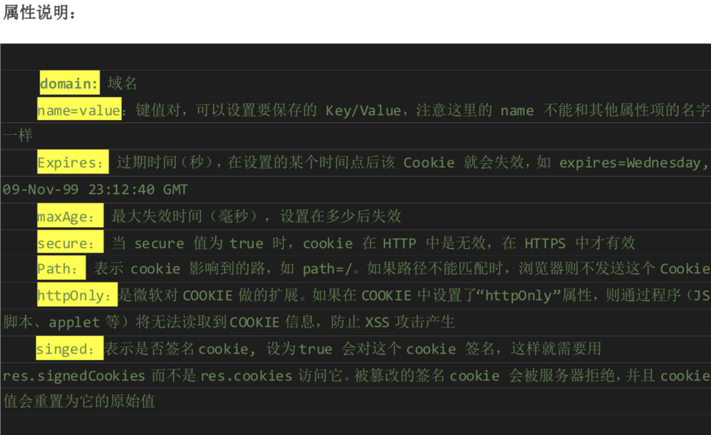

# 一、nodejs介绍

## 1.1 简介

- `nodejs`是一个`JavaScript`运行环境。它让 `JavaScript` 可以开发后端程序，实现几乎其他后端语言实现的所有功能
- `Nodejs` 是基于 `V8` 引擎，`V8` 是 `Google` 发布的开源 `JavaScript` 引擎，本身就是用于 `Chrome` 浏览器 的 `JS` 解释部分， `V8` 搬到了服务器上，用于做服务器的软件
- 短短几年的时间，Node 取得了巨大的成功。在企业界，Node 的应用也越来越广泛，2016 年 nodeJS 官方的调查报告。2016 年全球有 350 万开发者使用 nodeJS,相比去年保持了 100%的增长率。像 Yahoo、 Microsoft 这样的大公司，有好多应用已经迁移到 Node 了。国内的阿里巴巴、网易、腾讯、新浪、百度等 公司的很多线上产品也纷纷改用 Node 开发，并取得了很好的效果。据统计很多 A 轮、 B 轮的创业公司更 喜欢使用 NodeJs 开发。

> https://nodejs.org/static/documents/2016-survey-report.pdf


## 1.2 NodeJs 的优势

**1. NodeJs 语法完全是 js 语法，只要你懂 JS 基础就可以学会 Nodejs 后端开发**

> Node 打破了过去 JavaScript 只能在浏览器中运行的局面。前后端编程环境统一，可以大大降低开发成本

**2. NodeJs 超强的高并发能力**

- `Node.js` 的首要目标是提供一种简单的、用于创建高性能服务器及可在该服务器中运行的各种应用程 序的开发工具
- 首先让我们来看一下现在的服务器端语言中存在着什么问题。
在 `Java`、`PHP` 或者`.net` 等服务器端语言中，会为每一个客户端连接创建一个新的线程。而每个线程需要耗费大约 `2MB` 内存
理论上，一个 `8GB` 内存的服务器可以同时连接的最大用户数为 `4000` 个左右
。要让 `Web` 应用程序支持更多的用户，就 需要增加服务器的数量，而 `Web` 应用程序的硬件成本当然就上升了
- `Node.js` 不为每个客户连接创建一个新的线程，而仅仅使用一个线程。当有用户连接了，就触发一个 内部事件，通过非阻塞 `I/O`、事件驱动机制，让 `Node.js` 程序宏观上也是并行的。使用 `Node.js`，一个 `8GB` 内存的服务器，可以同时处理超过 `4 万`用户的连接

**3. 实现高性能服务器**

- 严格地说，`Node.js` 是一个用于开发各种 Web 服务器的开发工具。在 `Node.js` 服务器中，运行的是高性能 `V8 JavaScript` 脚本语言，该语言是一种可以运行在服务器端的 `JavaScript` 脚本语言
- 那么，什么是 `V8 JavaScript` 脚本语言呢?该语言是一种被 `V8 JavaScript` 引擎所解析并执行的脚本语言。`V8 JavaScript` 引擎是由 `Google` 公司使用 C++语言开发的一种高性能 `JavaScript` 引擎，该引擎并不局限于在浏览 器中运行。`Node.js` 将其转用在了服务器中，并且为其提供了许多附加的具有各种不同用途的 `API`。例如， 在一个服务器中，经常需要处理各种二进制数据。在 `JavaScript` 脚本语言中，只具有非常有限的对二进制数 据的处理能力，而 `Node.js` 所提供的 `Buffer` 类则提供了丰富的对二进制数据的处理能力
- 另外，在 `V8 JavaScript`引擎内部使用一种全新的编译技术。这意味着开发者编写的高端的 `JavaScript` 脚本代码与开发者编写的低端的C语言具有非常相近的执行效率，这也是`Node.js`服务器可以提供的一个重要特性

**4. 开发周期短、开发成本低、学习成本低。**

- `Node.js` 自身哲学，是花最小的硬件成本，追求更高的并发，更高的处理性能。
- 特点:`Node.js uses an event-driven, non-blocking I/O model that makes it lightweight and efficient.`

## 1.3 NodeJs 适合做什么

> 在短短几年多的时间里，`Node` 变得非常热门，使用者也非常多。这些使用者对于 `Node` 的各自倚重点也各部相同，经过整理,主要有下几类

**1. 前后端编程语言环境统一**

> 这类重点的代表是雅虎。雅虎开放了 `Cocktai` 框架，利用 自己深厚的前端沉淀，将 `YUI3` 这个前端框架的能力借助 `Node` 延伸到服务器端，使得使用 者摆脱了日常工作中一边写 `JavaScript` —边写 `PHP` 所帯来的上下文交换负担

**2. Node 带来的高性能 I/0 用于实时应用**

> `Voxer` 将 `Node` 应用在实时语音上。国内腾讯的 朋友网将 Node 应用在长连接中，以提供实时功能，花瓣网、蘑菇街等公司通过 `socket.io` 实 现实时通知的功能。

**3. 并行 I/0 使得使用者可以更高效地利用分布式环境**

> 阿里巴巴 eBay 是这方面的典型。 阿里巴巴的 NodeFox 和 eBay 的 ql.io 都是借用 Node 并行 I/O 的能力，更高效地使用已有的 数据

**4. 并行 I/O •有效利用稳定接口提升 Web 渲染能力**

> 雪球财经和 Linkedln 的移动版网站均 是这种案例，撇弃 同步等待式的顺序请求，大胆采用并行丨/〇，加速数据的获取进而提升 Web 的渲染速度

**5. 云计算平台提供 Node 支持**

> 微软将 Node 引入 Azure 的开发中，阿里云、百度均纷纷 在云服务器上提供 Node 应用托管服务，Joyent 更是云计算中提供 Node 支持的代表。这类 平台看重 JavaScript 带来的开发上的优势，以及低资源占用、高性能的特点

**6. 游戏开发领域**

> 游戏领域对实时和并发有很高的要求，网易开源了 pomelo 实时框架， 可以应用在游戏和高实时应用中

**7. 工具类应用**

> 过去依赖 `java` 或其他语言构建的前端工具类应用，纷纷被一些前端工程 师用 `Node` 重写，用前端熟悉的语言为前端构建熟悉的工具

# 二、HTTP模块、URL模块 supervisor工具

> 用 `Node.js` 时，我们不仅仅在实现一个应用，同时还实现了整个 `HTTP` 服务器


## 2.1 创建一个简单的程序

```js
var http = require('http');

http.createServer(function(request, response) {
    // 发送 HTTP 头部
    // HTTP 状态值: 200 : OK
    //设置 HTTP 头部，状态码是 200，文件类型是 html，字符集是 utf8 response.writeHead(200,{"Content-Type":"text/html;charset=UTF-8"});
    // 发送响应数据 "Hello World"
    res.end("哈哈哈哈，我买了一个 iPhone" + (1 + 2 + 3) + "s");
}).listen(8888);
// 终端打印如下信息
console.log('Server running at http://127.0.0.1:8888/');
```

> 你会发现，我们本地写一个 `js`，打死都不能直接拖入浏览器运行，但是有了 `node`，我 们任何一个 `js` 文件，都可以通过 `node` 来运行。也就是说，`node` 就是一个 `js` 的执行环境


## 2.2 HTTP 模块、URL模块

> `Node.js` 中，将很多的功能，划分为了一个个 `module`(模块)。 `Node.js` 中的很多功能都 是通过模块实现

### 2.2.1、HTTP 模块的使用

```js
//引用模块
var http = require("http");
//创建一个服务器，回调函数表示接收到请求之后做的事情
var server = http.createServer(function(req, res) { //req 参数表示请求，res 表示响应
    console.log("服务器接收到了请求" + req.url);
    res.end(); // End 方法使 Web 服务器停止处理脚本并返回当前结果
});
//监听端口
server.listen(3000, "127.0.0.1");
```

**设置一个响应头**

```js
res.writeHead(200,{"Content-Type":"text/html;charset=UTF8"});
```


- 我们现在来看一下 `req` 里面能够使用的东西
- 最关键的就是 `req.url` 属性，表示用户的请求 `URL` 地址。所有的路由设计，都是通过 `req.url` 来实现的。
- 我们比较关心的不是拿到 `URL`，而是识别这个 `URL`
- 识别 `URL`，用到了下面的 `URL` 模块


### 2.2.2、URL 模块的使用

- `url.parse()`  解析`URL `
- `url.format(urlObject)` 是上面 `url.parse()` 操作的逆向操作
- `url.resolve(from, to)` 添加或者替换地址

**1. url.parse()**


**2. url.format()**


**3. url.resolve()**


## 2.3 Nodejs 自启动工具 supervisor

> `supervisor` 会不停的 `watch` 你应用下面的所有文件，发现有文件被修改，就重新载入程序文件这样就实现了部署，修改了程序文件后马上就能看到变更后的结果。麻麻再也不用担心我的重启 `nodejs` 了

**首先安装 supervisor**

``` 
npm install -g supervisor
```

**使用 supervisor 代替 node 命令启动应用**


# 三、CommonJs 和 Nodejs 模块

## 3.1 什么是 CommonJs

> `JavaScript` 是一个强大面向对象语言，它有很多快速高效的解释器。然而， `JavaScript` 标准定义的 `API` 是为了构建基于浏览器的应用程序。并没有制定一个用于更广泛的应用程序 的标准库。
,而不只是停留在小脚本程序 的阶段。用 `CommonJS API` 编写出的应用，不仅可以利用 `JavaScript` 开发客户端应用，而且还可以编写以下应 用 

- 服务器端 `JavaScript` 应用程序。(`nodejs`)
- 命令行工具
- 桌面图形界面应用程序

> `CommonJS` 就是模块化的标准，`nodejs` 就是 `CommonJS`(模块化)的实现

## 3.2 Nodejs 中的模块化

> `Node` 应用由模块组成，采用 `CommonJS` 模块规范

### 3.2.1 在 Node 中，模块分为两类

- 一类是 `Node` 提供的模块,称为核心模块;另一类是用户编写的模块，称为文件模块

> - 核心模块部分在 `Node` 源代码的编译过程中，编译进了二进制执行文件。在 `Node` 进程启动时，部分核心模块就被直接加载进内存中，所以这部分核心模块引入时，文件定位和 编译执行这两个步骤可以省略掉，并且在路径分析中优先判断，所以它的加载速度是最快的。 如:`HTTP` 模块 、`URL` 模块、`Fs` 模块都是 `nodejs` 内置的核心模块，可以直接引入使用
> - 文件模块则是在运行时动态加载，需要完整的路径分析、文件定位、编译执行过程、速度相比核心模块稍微慢一些，但是用的非常多。这些模块需要我们自己定义。接下来我 们看一下 `nodejs` 中的自定义模块。

### 3.2.2 CommonJS(Nodejs)中自定义模块的规定

1. 我们可以把公共的功能抽离成为一个单独的 `js` 文件作为一个模块，默认情况下面这 个模块里面的方法或者属性，外面是没法访问的。如果要让外部可以访问模块里面的方法或 者属性，就必须在模块里面通过 `exports` 或者 `module.exports` 暴露属性或者方法
2. 在需要使用这些模块的文件中，通过 `require` 的方式引入这个模块。这个时候就可以 使用模块里面暴露的属性和方法


### 3.2.3 定义使用模块

```js
// 定义一个 tools.js 的模块 //模块定义
var tools = {
    sayHello: function() {
        return 'hello NodeJS';
    },
    add: function(x, y) {
        return x + y;
    }
};
// 模块接口的暴露
// module.exports = tools; exports.sayHello = tools.sayHello; exports.add = tools.add;

```

```js
var http = require('http');
// 引入自定义的 tools.js 模块
var tools = require('./tools');

tools.sa yHello(); //使用模块
```

# 四、NPM第三方模块和package

## 4.1 包与 NPM

### 4.1.1 包

> `Nodejs` 中除了它自己提供的核心模块外，我们可以自定义模块，也可以使用 第三方的模块。`Nodejs` 中第三方模块由包组成，可以通过包来对一组具有相互依 赖关系的模块进行统一管理


**完全符合 CommonJs 规范的包目录一般包含如下这些文件**

- `package.json` :包描述文件
- `bin` :用于存放可执行二进制文件的目录
- `lib` :用于存放 `JavaScript` 代码的目录
- `doc` :用于存放文档的目录

> 在 `NodeJs` 中通过 `NPM` 命令来下载第三方的模块(包)


### 4.1.2 NPM 介绍

- npm 是世界上最大的开放源代码的生态系统。我们可以通过 npm 下载各种各样的包，
这些源代码(包)我们可以在 https://www.npmjs.com 找到

> `npm` 是随同 `NodeJS` 一起安装的包管理工具，能解决 `NodeJS` 代码部署上的很多问题，常见的使用场景有 以下几种

- 允许用户从 `NPM` 服务器下载别人编写的第三方包到本地使用
- 允许用户从 `NPM` 服务器下载并安装别人编写的命令行程序(工具)到本地使用
- 允许用户将自己编写的包或命令行程序上传到 `NPM` 服务器供别人使用

**NPM 命令详解**

- `npm -v` 查看 `npm` 版本
- `npm install` 使用 `npm` 命令安装模块
- `npm uninstall moudleName` 卸载模块
- `npm list` 查看当前目录下已安装的 `node` 包
- `npm info jquery` 查看 `jquery` 的版本
- 指定版本安装 `npm install jquery@1.8.0`

## 4.2 package.json

> `package.json` 定义了这个项目所需要的各种模块,以及项目的配置信息(比如名称、
版本、许可证等元数据)

**1. 创建 package.json**

```
npm init
npm init –yes
```

**2. 安装模块并把模块写入 package.json(依赖)**

- `npm install babel-cli --save-dev`
- `npm install 模块 --save`

**3. dependencies 与 devDependencies 之间的区别**

- 使用 `npm install node_module –save` 自动更新 `dependencies` 字段值;
- 使用 `npm install node_module –save-dev` 自动更新 `devDependencies` 字段值
- `dependencies` 配置当前程序所依赖的其他
- `devDependencies` 配置当前程序所依赖的其他包，只会下载模块，而不下载这些模块的测试 和文档框架

```
"dependencies": {
    "ejs": "^2.3.4",
    "express": "^4.13.3",
    "formidable": "^1.0.17"

}
```

- `^`表示第一位版本号不变，后面两位取最新的 
- `~`表示前两位不变，最后一个取最新 
- `*`表示全部取最新

## 4.3 安装淘宝镜像

- http://www.npmjs.org npm 包官网
- https://npm.taobao.org/ 淘宝 npm 镜像官网


> 淘宝 `NPM` 镜像是一个完整 `npmjs.org` 镜像，你可以用此代替官方版本(只读)，同步频 率目前为 10 分钟 一次以保证尽量与官方服务同步

我们可以使用我们定制的 `cnpm` (`gzip` 压缩支持) 命令行工具代替默认的 `npm`:


```
npm install -g cnpm --registry=https://registry.npm.taobao.org
```


# 五、fs模块

## 5.1 fs.stat 检测是文件还是目录

```js
const fs = require('fs')

fs.stat('hello.js', (error, stats) = >{
    if (error) {
        console.log(error)
    } else {
        console.log(stats) 
        
        console.log(`文件: $ {
            stats.isFile()
        }`) 
        
        console.log(`目录: $ {
            stats.isDirectory()
        }`)
    }
})
```

## 5.2 fs.mkdir 创建目录

```js
const fs = require('fs') 

fs.mkdir('logs', (error) = >{
    if (error) {
        console.log(error)
    } else {
        console.log('成功创 建目录:logs')
    }
})
```

## 5.3 fs.writeFile 创建写入文件

```js
fs.writeFile('logs/hello.log', '您好 ~ \n', (error) = >{
    if (error) {
        console.log(error)
    } else {
        console.log('成功写 入文件')
    }
})
```

## 5.4 fs.appendFile 追加文件

```js
fs.appendFile('logs/hello.log', 'hello ~ \n', (error) = >{
    if (error) {
        console.log(error)
    } else {
        console.log('成功写 入文件')
    }
})
```

## 5.5 fs.readFile 读取文件

```js
const fs = require('fs') 

fs.readFile('logs/hello.log', 'utf8', (error, data) = >{
    if (error) {
        console.log(error)
    } else {
        console.log(data)
    }
})
```

## 5.6 fs.readdir 读取目录

```js
const fs = require('fs') 

fs.readdir('logs', (error, files) = >{
    if (error) {
        console.log(error)
    } else {
        console.log(files)
    }
})
```

## 5.7 fs.rename 重命名

```js
const fs = require('fs') 

fs.rename('js/hello.log', 'js/greeting.log', (error) = >{
    if (error) {
        console.log(error)
    } else {
        console.log(' 重命名成功')
    }
})
```

## 5.8 fs.rmdir 删除目录

```js
fs.rmdir('logs', (error) = >{
    if (error) {
        console.log(error)
    } else {
        console.log('成功的删除了目录:logs')
    }
})
```

## 5.9 fs.unlink 删除文件

```js
fs.unlink(`logs / $ {
    file
}`, (error) = >{
    if (error) {
        console.log(error)
    } else {
        console.log(`成功的删除了文件: $ {
            file
        }`)
    }
})
```

## 5.10 fs.createReadStream 从文件流中读取数据

```js
const fs = require('fs') 

var fileReadStream = fs.createReadStream('data.json') 
let count = 0;
var str = '';

fileReadStream.on('data', (chunk) = >{
    console.log(`$ {++count
    }接收到: $ {
        chunk.length
    }`);
    str += chunk
}) 

fileReadStream.on('end', () = >{
    console.log('--- 结束 ---');
    console.log(coun t);
    console.log(str);
}) 

fileReadStream.on('error', (error) = >{
    console.log(error)
})
```

## 5.11 fs.createWriteStream 写入文件

```js
var fs = require("fs");
var data = '我是从数据库获取的数据，我要保存起来';
// 创建一个可以写入的流，写入到文件 output.txt 中
var writerStream = fs.createWriteStream('output.txt'); // 使用 utf8 编码写入数据

writerStream.write(data, 'UTF8'); // 标记文件末尾
writerStream.end();
// 处理流事件 --> finish 事件
writerStream.on('finish',
function() {
    /*finish - 所有数据已被写入到底层系统时触发。*/
    console.log("写入完 成。");
});
writerStream.on('error',
function(err) {
    console.log(err.stack);
});
console.log("程序执 行完毕");
```

## 5.12 管道流

> 管道提供了一个输出流到输入流的机制。通常我们用于从一个流中获取数据并将数据传递到另外一个流中。


> 如上面的图片所示，我们把文件比作装水的桶，而水就是文件里的内容 ，我们用一根管子(pipe )连接两个桶使得水从一个桶流入另一个桶，这样就慢慢的实现了大文件的复制过程。

以下实例我们通过读取一个文件内容并将内容写入到另外一个文件中

```js
var fs = require("fs");
// 创建一个可读流
var readerStream = fs.createReadStream('input.txt'); // 创建一个可写流
var writerStream = fs.createWriteStream('output.txt');

// 管道读写操作
// 读取 input.txt 文件内容，并将内容写入到 output.txt 文件中 
readerStream.pipe(writerStream);
console.log("程 序执行完毕");
```

# 六、创建一个 WEB 服务器

> 利用HTTP模块 URl模块 PATH模块 FS 模块创建一个 WEB 服务器

**1. Node.js 创建的第一个应用**

> 引入 http 模块

```js
var http = require("http");
```

**2. 创建服务器**

> 接下来我们使用 `http.createServer()` 方法创建服务器，并使用 `listen` 方法绑定 `8888` 端口。 函数通过 `request`, `response` 参数来接收和响应数据

```js
//1.引入 http 模块
var http=require('http');

//2.用 http 模块创建服务
http.createServer(fun ction(req, res) {
    // 发送 HTTP 头部
    // HTTP 状态值: 200 : OK
    //设置 HTTP 头部，状态码是 200，文件类型是 html，字符集是 utf-8
    res.writeHead(200, {
        "Content-Type": "text/html;charset='utf-8'"
    });
    res.write('你好 nodejs');
    res.write('我是第一个 nodejs 程序');
    res.end();
    /*结束响应*/
}).listen(8001);
```

**3. WEB 服务器介绍**

> Web 服务器一般指网站服务器，是指驻留于因特网上某种类型计算机的程序，可以向浏览 器等 Web 客户端提供文档，也可以放置网站文件，让全世界浏览;可以放置数据文件，让 全世界下载。目前最主流的三个 Web 服务器是 Apache Nginx IIS。

# 七、Nodejs 的非阻塞 I/O、异步、事件驱动

## 7.1 Nodejs的单线程 非阻塞I/O事件驱动

- 在 Java、PHP 或者.net 等服务器端语言中，会为每一个客户端连接创建一个新的线程。 而每个线程需要耗费大约 2MB 内存。也就是说，理论上，一个 8GB 内存的服务器可以同时 连接的最大用户数为 4000 个左右。要让 Web 应用程序支持更多的用户，就需要增加服务器 的数量，而 Web 应用程序的硬件成本当然就上升了
- Node.js 不为每个客户连接创建一个新的线程，而仅仅使用一个线程。当有用户连接了， 就触发一个内部事件，通过非阻塞 I/O、事件驱动机制，让 Node.js 程序宏观上也是并行的。 使用 Node.js，一个 8GB 内存的服务器，可以同时处理超过 4 万用户的连接。

## 7.2 Nodejs 回调处理异步

```js
//错误的写法:
function getData(){ 
    //模拟请求数据 
    var result='';
    setTimeout(functio n (){ 
        result='这是请求到的 数据'
    },200);
    
    return result; 
}
console .log(getData());/*异步导致请求不到数据*/
```

```js
//正确的处理异步:
function getData(callback) { //模拟请求数据
    var result = '';
    setTimeout(function() {
        result = '这是请求到的 数据';
        callback(result);
    },
    200);
}
getData(function(data) {
    console.log(data);
})
```

## 7.3 Nodejs events 模块处理异步

> `Node.js` 有多个内置的事件，我们可以通过引入 `events` 模块，并通过实例化 `EventEmitter` 类来绑定和监听事件。


```js
// 引入 events 模块
var events = require('events');
var Even tEmitter =new event s .EventEmitter() ; /*实例化事件对象*/
EventEmitter.on('toparent',function(){ console.log('接收到了广播事件');
})
setTimeout(function (){
    console.log('广播');
    EventEmitter.emit('toparent' ); /*发送广播*/ 
},1000)
```

# 八、静态文件托管 GET POST路由EJS模板引擎


## 8.1 路由

> 路由指的就是针对不同请求的 URL，处理不同的业务逻辑。


## 8.2 初识 EJS 模块引擎

> 我们学的 EJS 是后台模板，可以把我们数据库和文件读取的数据显示到 Html 页面上面。它 是一个第三方模块，需要通过 npm 安装

```
npm install ejs –save / cnpm install ejs --save
```

> Nodejs 中使用:

```js
ejs.renderFile(filename, data, options, function(err, str){
// str => Rendered HTML string
});
```

**EJS 常用标签**

- `<%%>`流程控制标签
- `<%=%>`输出标签(原文输出HTML标签)
- `<%-%>`输出标签(HTML会被浏览器解析)

```html
<a href="<%= url %>">" alt=""></a><ul>
```

```html
<html>
 <head></head>
 <body>
  <ul>
    &lt;% for(var i = 0 ; i &lt; news.length ; i++){ %&gt; 
   <li>&lt;%= news[i] %&gt;</li> &lt;% } %&gt; 
  </ul>
 </body>
</html>
```

## 8.3 Get、Post

- 超文本传输协议(HTTP)的设计目的是保证客户端机器与服务器之间的通信
- 在客户端和服务器之间进行请求-响应时，两种最常被用到的方法是:GET 和 POST
  - GET - 从指定的资源请求数据。(一般用于获取数据)
  - POST - 向指定的资源提交要被处理的数据。(一般用于提交数据)
  

**获取 GET 传值:**

```js
var urlinfo=url.parse(req.url,true); 
urlinfo.query();
```

**获取 POST 传值:**

```js
var postData = ''; 

// 数据块接收中
req.on('data',
function(postDataChunk) {
    postData += postDataChunk;
});
// 数据接收完毕，执行回调函数
req.on('end',
function() {
    try {
        postData = JSON.parse(postData);
    } catch(e) {}
    req.query = postData;
    console.log(q uerystring.parse(postData));
});
```

# 九、MongoDb 数据库介绍、安装、使用

## 9.1 数据库和文件的主要区别

- 数据库有数据库表、行和列的概念，让我们存储操作数据更方便
- 数据库提供了非常方便的接口，可以让 `nodejs`、`php` `java` `.net` 很方便的实现增加修改删除功能

## 9.2 NoSql 介绍

### 9.2.1 NoSQL 介绍

- 由于互联网的迅速发展，云计算与 Web2.0。这样大量的交互给数据库提出了更高的性能要
求，传统的数据库(本文泛指 SQL 数据库)，即关系数据库虽然具备良好的事物管理，
但在 处理大量数据 的应用 时很难 在性能 上满足 设计要 求。NoSQL 就是主要为了解决当下大量高并发高要求的数据 库应用 需求，关系数 据库 具有严 格的参 照性，一致性 ，可用 性，原子性 ，隔离 性等特 点
- 因此会产生一些例如表连接等操作，这样会大大降低系统的性能。而在当前很多应用场景下对性能的要求 远远强 于传统 数据库 关注的 点，`NoSQL`就是为了解决大规模数据与多样数 据种类 等问题，尤其是其中大数据的相关问题。 
- `NoSQL`(`NoSQL = Not Only SQL` )，意即“不仅仅是 SQL”，它指的是非关系型的数据库，是以 `key-value`
形式存储，和传统的关系型数据库不一样，不一定遵循传统数据库的一些基本要求，比如说遵循SQL 标准ACID 属性、表结构等等。`NoSQL` 最早被提出是在 20 世纪 80 年代，在当时更多是强调的是与关系数据库区 别对待 ，最近这些年被提及的更多是强调协助解决大数据等相关问题。`NoSQL` 在大数据时代有自己的意义

### 9.2.2 NoSQL 应用情况介绍

> 国内的互联网蓬勃发展，不仅涌现出 BAT(百度，阿里巴巴，腾讯)之类的巨头，也带动了整个互联 网行业的发展，大量的创业型公司如春笋般的涌出，在国家层面也提出了“互联网+”和“万众创业”的口 号。更多传统的行业也开始拥抱互联网。但是无论是做所谓的生态平台还是 传统业务的转型，涉及到的业务是多种多样的。这个时候企业架构师对于应用系统的核心——数据库管理 不仅有传统的 SQL 选项也有了 NoSQL这种适合特定场景需求的选项

**NoSQL 数据库在以下的这几种情况下比较适用**

- 数据模型比较简单
- 需要灵活性更强的 IT 系统
- 对数据库性能要求较高
- 不需要高度的数据一致性
- 对于给定 key，比较容易映射复杂值的环境

**NoSQL 发展现状**

- 国外: Google 的 BigTable 和 Amazon 的 Dynamo 使用的就是 NoSQL 型数据库。
- 国内:百度、阿里、腾讯、新浪微博、视觉中国、优酷运营数据分析、飞信空间、豆瓣社区等

## 9.3 什么时候建议使用 NoSql

- 对数据库高并发读写的需求
- 对海量数据的高效率存储和访问的需求
- 对数据库的高可扩展性和高可用性的需求

## 9.4 NoSql 和传统数据库简单对比

- 非结构型数据库。没有行、列的概念。用 JSON 来存储数据。
- 集合就相当于“表 ”，文档就相当于“行”。


## 9.5 NoSql 种类


## 9.6 MongoDb 介绍

> MongoDB 是一个介于关系数据库和非关系数据库之间的产品，是非关系数据库当中功能最丰富，最像 关系数据库的。他支持的数据结构非常松散，是类似 json 的 bson 格式，因此可以存储比较复杂的数据类 型。Mongo 最大的特点是他支持的查询语言非常强大，其语法有点类似于面向对象的查询语言，几乎可以 实现类似关系数据库单表查询的绝大部分功能，而且还支持对数据建立索引。它的特点是高 性能 、易部署 、 易使用 ，存储数据非常 方便 

## 9.7 MongoDb 安装

- 官网:https://www.mongodb.com/
- 手册:https://docs.mongodb.org/manual/

**1. 双击 MongoDB 软件下一步下一步安装**


**2. 安装完成配置环境变量 C:\Program Files\MongoDB\Server\3.0\bin 加入到系统的path 环境变量中**

**3. 打开 cmd 输入 :mongo命令看看是否成功。如果出来下图说明 mongodb配置成功。**


## 9.8 使用 MongoDb

1. 新建一个存放数据库的文件夹，注意:不能有中文和空格，建议不要放在 C 盘
2. 启动 MongoDb 服务

> 服务端:`mongod` 开启数据库服务 `mongod --dbpath C:\mongodb`

**开启 MongoDb 服务命令:**


- `--dbpath` 就是选择数据库文档所在的文件夹
- 也就是说，`mongoDB` 中，真的有物理文件，对应一个个数据库。U 盘可以拷走。
- 注意:一定要保持，开机这个 CMD 不能动了，不能关，不能 `ctrl+c`。 一旦这个 `cmd` 有问题了，数据库就自动关闭了

3. 客户端输入 `mongo` 命令连接服务端

> 客户端:`mongo` 使用数据库


> 客户端:`mongo` 使用数据库 `ip` 地址:端口号


# 十、MongoDB 数据库创建删除、表（集合）创建删除、数据增删改查

## 10.1 数据库使用

>  开启 `mongodb` 服务:要管理数据库，必须先开启服务，开启服务使用 `mongod --dbpath c:\mongodb`


> 管理 `mongodb` 数据库:`mongo` (一定要在新的 `cmd` 中输入)


> 查看所有数据库列 表

```
show dbs
```

## 10.2 创建数据库


**使用数据库、创建 数据库**

```
use student
```

- 如果真的想把这个数据库创建成功，那么必须插入一个数据
- 数据库中不能直接插入数据，只能往集合(collectio ns)中插入数 据。不需要专门创建集合，只需要写点语法插入数据就会创建集合:

```
db.student.insert({“name”:”x iaom ing”});
```

- db.student 系统发现 student 是一个陌生的集合名字，所以就自动创建了集合

**显示当前的数据集合(mysql 中叫表)**

```
show collections
```

**删除数据库，删除当前所在的数据库**

```
db.dropDatabase();
```

**删除集合，删除指定的集合删除表**

> 删除集合 

```
db.COLLECTION_NAME.drop()

db.user.drop()
```

## 10.3 插入(增加)数据

> 插入数据，随着数据的插入，数据库创建成功了，集合也创建成功了。

```
db.表名.insert({"name":"zhangsan"});

student 集合名称(表)
```


## 10.4 查找数据

**1. 查询所有记 录**

```
db.userInfo.find();
```

> 相当于:`select* from userInfo;`

**2. 查询去掉后 的当前聚集集合中的某列的重复数据**

```
db.userInfo.distinct("name");
```

- 会过滤掉 `name` 中的相同数据
- 相当于:`select distict name from userInfo;`

**3. 查询 age = 22 的记录**

```
db.userInfo.find({"age": 22});
```

> 相当于: `select * from userInfo where age = 22;`

**4. 查询 age > 22 的记录**

```
db.userInfo.find({age: {$gt: 22}});
```

> 相当于:`select * from userInfo where age >22;`

**5. 查询 age < 22 的记录**

```
db.userInfo.find({age: {$lt: 22}});
```

> 相当于:`select * from userInfo where age <22;`

**6. 查询 age >= 25 的记录**

```
db.userInfo.find({age: {$gte: 25}});
```

> 相当于:`select * from userInfo where age >= 25;`

**7. 查询 age <= 25 的记录**

```
db.userInfo.find({age: {$lte: 25}});
```

**8. 查询 age >= 23 并且 age <= 26**

```
db.userInfo.find({age: {$gte: 23, $lte: 26}});
```

**9. 查询name中包含 mongo的数据,模糊查询用于搜索**

```
db.userInfo.find({name: /mongo/});
```

```
//相当于%%
select * from userInfo where name like ‘%mongo%’;
```

**10. 查询 name 中以 mongo 开头的**

```
db.userInfo.find({name: /^mongo/});
```

> `select * from userInfo where name like ‘mongo%’;`

**11. 查询指定列 name、age 数据**

```
db.userInfo.find({}, {name: 1, age: 1});
```

> 相当于:`select name, age from userInfo;`

> 当然 `name` 也可以用 `true` 或 `false`,当用 `ture` 的情况下河 `name:1` 效果一样，如果用 `false` 就 是排除 `name`，显示 `name` 以外的列信息

**12. 查询指定列 name、age 数据, age > 25**

```
db.userInfo.find({age: {$gt: 25}}, {name: 1, age: 1});
```

> 相当于:`select name, age from userInfo where age >25;`

**13. 按照年龄排序 1 升序 -1 降序**

- 升序:`db.userInfo.find().sort({age: 1});`
- 降序:`db.userInfo.find().sort({age: -1});`

**14. 查询 name = zhangsan, age = 22 的数据**

```
db.userInfo.find({name: 'zhangsan', age: 22});
```

> 相当于:`select * from userInfo where name = ‘zhangsan’ and age = ‘22’;`

**15. 查询前 5 条数据**

```
db.userInfo.find().limit(5 );
```

> 相当于:`selecttop 5 * from userInfo;`

**16. 查询 10 条以后的数据**

```
db.userInfo.find().skip(10);
```

```
// 相当于:
select * from userInfo where id not in ( 
    selecttop 10 * from userInfo
);
```

**17. 查询在 5-10 之间的数据**

```
db.userInfo.find().limit (10).skip(5);
```

> 可用于分页，`limit` 是 `pageSize`，`skip` 是第几页`*pageSize`

**18. or与 查询**

```
db.userInfo.find({$or: [{age: 22}, {age: 25}]});
```

> 相当于:`select * from userInfo where age = 22 or age = 25;`

**19. findOne 查询第一条数据**

```
db.userInfo.findOne( );
```

> 相当于:`selecttop 1 * from userInfo;`

```
db.userInfo.find().limit(1 );
```

**20. 查询某 个结果集的记录条数 统计数量**

```
db.userInfo.find({age: {$gte: 25}}).count();
```

> 相当于:`select count(*) from userInfo where age >= 20;`

> 如果要返回限制之后的记录数量，要使用 `count(true)`或者 `count`(非 `0`)

```
db.users.find().skip(1 0).limit(5).count(true);
```

## 10.5 修改数据

> 修改里面还有查询条件。你要该谁，要告诉 `mongo`

**查找名字叫做小明的，把年龄更改为 16 岁**

```
db.student.update({"name":"小明"},{$set:{"ag e":16}});
```

**查找数学成绩是 70，把年龄更改为 33 岁:**

```
db.student.update({"sc ore.shuxue":70},{$set:{"ag e":33}});
```

**更改所有匹配项目**

```
db.student.update({"sex":"男"},{$set:{"age":33}},{multi: true});
```

**完整替换，不出现$set 关键字了: 注意**

```
db.student.update({"name":"小明"},{"name":"大明","age":16});
```

> `db.users.update({name: 'Lisi'}, {$inc: {age: 50}}, false, true);` 相当于:`update users set age = age + 50 where name = ‘Lisi’;`

> `db.users.update({name: 'Lisi'}, {$inc: {age: 50}, $set: {name: 'hoho'}}, false, true);` 相当于: `update users set age = age + 50, name = ‘hoho’ where name = ‘Lisi’;`

## 10.6 删除数据

```
db.collectionsNames.remove( { "borough": "Manhattan" } )

db.users.remove({age: 132});

db.restaurants.remove( { "borough": "Queens" }, { justOne: true } )
```

# 十一、MongoDB 索引 explain 分析查询速度

## 11.1 索引基础

> 索引是对数据库表中一列或多列的值进行排序的一种结构，可以让我们查询数据库变得 更快。MongoDB 的索引几乎与传统的关系型数据库一模一样，这其中也包括一些基本的查 询优化技巧。

**下面是创建索引的 命令**

```
db.user.ensureIndex( {"username":1})
```

**获取当前集合的索 引**

```
db.user.getIndexes()
```

**删除索引的命令是**

```
db.user.dropIndex( {"username":1})
```

- 在 MongoDB 中，我们同样可以创建复合索引，如:
- 数字 `1` 表示 `username` 键的索引按升序存储，`-1` 表示 `age` 键的索引按照降序方式存储

```
db.user.ensureIndex({"username":1, "age":-1})
```

> 该索引被创建后，基于 username 和 age 的查询将会用到该索引，或者是基于 username 的查询也会用到该索引，但是只是基于 age 的查询将不会用到该复合索引。因此可以说，如果想用到复合索引，必须在查询条件中包含复合索引中的前 N个索引列。然而如果查询条件中的键值顺序和复合索引中的创建顺序不一致的话，MongoDB 可以智能的帮助我们调整该顺序，以便使复合索引可以为查询所用。如:

```
db.user.find({"age": 30, "username": "stephen"})
```

> 对于上面示例中的查询条件，MongoDB 在检索之前将会动态的调整查询条件文档的顺 序，以使该查询可以用到刚刚创建的复合索引。


> 对于上面创建的索引，MongoDB 都会根据索引的 keyname 和索引方向为新创建的索引自动分配一个索引名，下面的命令可以在创建索引时为其指定索引名，如:


```
db.user.ensureIndex( {"username":1},{"name":"userindex"})
```

> 随着集合的增长，需要针对查询中大量的排序做索引。如果没有对索引的键调用 `sort`， `MongoDB` 需要将所有数据提取到内存并排序。因此在做无索引排序时，如果数据量过大以 致无法在内存中进行排序，此时 `MongoDB` 将会报错

## 11.2 唯一索引

> 在缺省情况下创建的索引均不是唯一索引。下面的示例将创建唯一索引，如

```
db.user.ensureIndex( {"useri d":1},{"uniq ue":true})
```

> 如果再次插入 userid 重复的文档时，MongoDB 将报错，以提示插入重复键，如:

```
db.user.insert({"userid":5}) 
db.user.insert({"userid":5})

// E11000 duplicate key error index: user.user.$userid_1 dup key: { : 5.0 }
```

> 如果插入的文档中不包含 userid 键，那么该文档中该键的值为 null，如果多次插入类似 的文档，MongoDB 将会报出同样的错误，如:

```
db.user.insert({"userid1":5}) 
db.user.insert({"userid1":5})

// E11000 duplicate key error index: user.user.$userid_1 dup key: { : null }
```

> 如果在创建唯一索引时已经存在了重复项，我们可以通过下面的命令帮助我们在创建唯 一索引时消除重复文档，仅保留发现的第一个文档，如:

**先删除刚刚创建的唯一索引**

```
db.user.dropIndex( {" userid" :1} )
```

**插入测试数据，以保证集合中有重复键存在。**

```
db.user.remove() 
db.user.insert({"userid":5})
db.user.insert({"userid":5})
```

**重新创建唯一索引**

```
db.user.ensureIndex({"userid":1},{"unique":true })
```

**我们同样可以创建 复合唯一索引，即保证复合键值唯一 即可。如:**

```
db.user.ensureIndex( {"useri d":1,"age":1},{"unique":true})
```

## 11.3 索引的一些参数


> 如果在为已有数据的文档创建索引时，可以执行下面的命令，以使 MongoDB 在后台创 建索引，这样的创建时就不会阻塞其他操作。但是相比而言，以阻 塞方式创建索引，会使整 个创建过程效率更高，但是在创建时 MongoDB 将无法接收其他的操作

```
db.user.ensureIndex( {"username":1},{"backgroun d":true})
```

## 11.4 使用 explain

> explain 是非常有用的工具，会帮助你获得查询方面诸多有用的信息。只要对游标调用 该方法，就可以得到查询细节。explain 会返回一个文档，而不是游标本身。如


> `explain` 会返回查询使用的索引情况，耗时和扫描文档数的统计信息

## 11.5 explain executionStats 查询具体的执行 时间

```
db.tablename.find().explain( "executionStats" )
```

> 关注输出的如下数值:`explain.executionStats.executionTimeMillis`

# 十二、nodejs操作mongodb3.x数据库的方法

```js

//http://mongodb.github.io/node-mongodb-native/3.0/quick-start/quick-start/

/*
nodejs操作mongodb数据库

 1.安装mongodb、

    cnpm install mongodb --save


 2.引入mongodb下面的MongoClient
    var MongoClient = require('mongodb').MongoClient;


 3.定义数据库连接的地址 以及配置数据库
    qianfeng数据库的名称

    var url = 'mongodb://localhost:27017/';

    var dbName = 'shop'


 4.nodejs连接数据库


 MongoClient.connect(url,function(err,client){

        const db = client.db(dbName);  数据库db对象

 })

5.操作数据库
    


	 MongoClient.connect(url,function(err,client){

			const db = client.db(dbName);  数据库db对象


			MongoClient.connect(url,function(err,db){


				db.collection('user').insertOne({"name":"张三"},function(err,result){

					db.close() //关闭连接
				})

		     })

	 })
     

*/
var MongoClient = require('mongodb').MongoClient;


//定义连接数据库的地址

const  url = 'mongodb://localhost:27017/';
var dbName = 'shop'

//连接数据库
MongoClient.connect(url,(err,client)=>{

    if(err){
        console.log('数据连接失败');
        return false;
    }
    let db=client.db(dbName);   /*获取db对象*/

    db.collection("admin").insertOne({"name":"mongodb3.0","age":10},function(err){

        if(err){
            console.log('增加失败');
            return false;
        }
        console.log('增加成功');
        client.close();  /*关闭数据库*/
    })


})
```

# 十三、NodeJs操作MongoDb数据库 数据的增加 修改 删除

## 13.1 在 Nodejs 中使用 Mongodb

> 前面的课程我们讲了用命令操作 `MongoDB`，这里我们看下如何用 `nodejs` 来操作数据库

**需要引包**

```
npm install mongodb --save-dev / cnpm install mongodb --save-dev
```

## 13.2 Nodejs 连接 MongoDb 数据库

```js
var express = require("express"); //数据库引用

var MongoClient = require('mongodb').MongoClient;
var app = express();
//数据库连接的地址，最后的斜杠表示数据库名字
var shujukuURL = 'mongodb://localhost:27017/news';
app.get("/", fu nction(req, res) { //连接数据库，这是一个异步的操作
    MongoClient.connect(shujukuURL,
    function(err, db) {
        res.writeHe ad(200, {
            "Content-Type": " text/html;charset =UTF8"
        });
        if (err) {
            res.send("数据库连接失 败");
            return;
        }
        res.write("恭喜，数据库已经成功连接 \n");
        db.collection("user").insertOne({
            "name": "哈哈"
        },
        functio n(err, result) {
            if (err) {
                res.send("数据库写入 失败");
                return;
            }
            res.write("恭喜，数据 已经成功插入");
            res.end();
            //关闭数据库
            db.close();
        });
    });
});

app.listen(8020);
```

## 13.3 Nodejs 查找 MongoDb 数据库集合

```js
MongoClient.connect(dbUrl,
function(err, db) {
    if (err) {
        /*数据库连接失败*/
        console.log('数据库连接失败');
        return;
    }
    var result = [];
    var userRel = db.collection('user').find();
    //res.send(userRel);
    userRel.each(function(err, doc) {
        if (err) {
            res.write("游标遍历错 误");
            return;
        }
        if (doc != null) {
            result.push(doc);
        } else {
            console.log(result); //遍历完毕
            db.close();
            res.render("index", {
                "result": result
            });
        }
    });
})
```

## 13.4 Nodejs 给 MongoDb 增加数据

```js
MongoClient.connect(dbUrl,
function(err, db) {
    if (err) {
        return
    }
    db.collection('user').insertOne({
        "name": name,
        "age": age,
        "score": {
            "shuxue": shuxuechengji,
            "yuwen": yuwenchengji
        }
    },
    function(err, result) {
        if (err) {
            console.log('写入数据失败');
        }
        //关闭数据库
        db.close();
        //res.redirect('/add'); res.redirect('/' ); /*路由跳转*/ res.end(); ////res.location('/add')
    })
})
```

## 13.5 Nodejs 修改 MongoDb 数据

```js
MongoClient.connect(dbUrl,
function(err, db) {
    if (err) {
        console.log('数据库连接错误');
        return;
    }
    db.collection('user').updateOne({
        "_id": ObjectID(id)
    },
    {
        "name": name,
        "age": age,
        "score": {
            "shuxue": shuxue,
            "yuwen": yuwen
        }
    },
    function(err, results) {
        console.log(results);
        db.close();
        res.redirect('/');
        /*路由跳转*/
        res.end('end');
    })
})
```

## 13.6 Nodejs 删除 MongoDb 数据

```js
MongoClient.connect(dbUrl,
function(err, db) {
    if (err) {
        throw new Error("数据库连接失败");
        return;
    }
    db.collection('user').deleteOne({
        "_id": ObjectID(id)
    },
    func tion(error, result) {
        if (error) {
            throw new Error('删除数据失败');
            return;
        }
        db.close();
        res.redirect('/');
        /*路由跳转*/
    })
})
```

# 十四、Express 安装和使用

## 14.1 Express 简单介绍

- Express 是一个基于 Node.js 平台，快速、开放、极简的 web 开发框架
- Express 框架是后台的 Node 框架，所以和 jQuery、zepto、yui、bootstrap 都不一个东西。 Express 在后台的受欢迎的程度类似前端的 jQuery，就是企业的事实上的标准。

**Express 特点**

- `Express` 是一个基于 `Node.js` 平台的极简、灵活的 web 应用开发框架，它提供一
系列强大的特性，帮助你创建各种 `Web` 和移动设备应用
- 丰富的 HTTP 快捷方法和任意排列组合的 `Connect` 中间件，让你创建健壮、友好的 API 变得既快速又简单
- `Express` 不对 `Node.js` 已有的特性进行二次抽象，我们只是在它之上扩展了 Web应用所需的基本功能

## 14.2 Express 安装使用

**安装:**

> 安装 Express 框架，就是使用 npm 的命令

```
npm install express --save
```

> `--save` 参数，表示自动修改 `package.json` 文件，自动添加依赖项

**简单使用**

```js
npm install express–save //1.引入
var express = require('express');
var app = express();
//2.配置路由
app.get('/',
function(req, res) {
    res.send('Hello World!');
}); //3.监听端口

app.listen(3000,'127.0.0.1');
```

**完整 Demo**

```js
var express = require('express');
/*引入 express*/
var app = newexpress();
/*实例化express 赋值给app*/
//配置路由 匹配 URl 地址实现不同的功能
app.get('/',
function(req, res) {
    res.send('首页');
}) 

app.get('/search',
function(req, res) {
    res.send('搜索'); //?keyword=华为手机&enc=utf-8&suggest=1.his.0.0&wq
}) 

app.get('/login',
function(req, res) {
    res.send('登录');
}) 

app.get('/register',
function(req, res) {
    res.send('注册');
}) 

app.listen(3000, "127.0.0.1");
```


## 14.3 Express 框架中的路由

> 路由(Routing)是由一个 URI(或者叫路径)和一个特定的 HTTP 方法(GET、POST 等) 组成的，涉及到应用如何响应客户端对某个网站节点的访问

**简单的路由配置**

> 当用 get 请求访问一个网址的时候，做什么事情

```js
app.get("网址",function(req,res){

});
```

> 当用 post 访问一个网址的时候，做什么事情:

```js
app.post("网址",function(req,res){

});
```

```js
// user 节点接受 PUT 请求

app.put('/user', function (req, res) {
    res.send('Got a PUT request at /user'); 
});
```

```js
// user 节点接受 DELETE 请求

app.delete('/user', function (req, res) {
    res.send('Got a DELETE request at /user'); 
});
```

**动态路由配置:**

```js
app.get( ,function(req,res){ 
    var id = req.params["id"];
    res.send(id); 
});
```

**路由的正则匹配:(了解)**

```js
app.get('/ab*cd', function(req, res) { 
    res.send('ab*cd');
});
```

**路由里面获取 Get 传值**

```js
// /news?id=2&sex=nan

app.get('/news, function(req, res) { 
    console.log(req.query);
});
```

## 14.4 Express 框架中 ejs 的安装使用

**Express 中 ejs 的安装:**

```
npm install ejs --save 

// 或者:
npm install ejs --save-dev
```


**Express 中 ejs 的使用**

```js
var express = require("express");
var app = express();
app.set("view engine", "ejs");

app.get("/",
    function(req, res) {});
        res.render("news", {
            "news": ["我是小新闻啊", "我也是啊", "哈哈哈哈"]
});
app.listen(3000);
```

**指定模板位置 ，默认模板位置在 views**

```
app.set('views', __dirname + '/views');
```

**Ejs 引入模板**

``` 
<%- include header.ejs %>
```

**Ejs 绑定数据**

```
<%=h%>
```

**Ejs 绑定 html 数据**

```
<%-h%>
```

**Ejs 模板判断语句**

```
<% if(true){ %> 
    <div>true</div>
    <%} 
  else{ %> 
    <div>false< /di v>
<%} %>
```

**Ejs 模板中循环数据**

```html
<%for(var i=0;i<list.length;i++) { %>
    <li><%=list[i] %></li>
<%}%>
```

**Ejs 后缀修改为 Html**

> 这是一个小技巧，看着`.ejs` 的后缀总觉得不爽，使用如下方法，可以将模板文件的后缀换成我们习惯的`.html`


1. 在 `app.js` 的头上定义 `ejs`:,代码如下:

```
var ejs = require('ejs');
```

2. 注册 html 模板引擎代码如下:


```js
app.engine('html',ejs.__express);
```

3. 将模板引擎换成 html代码如下:

```js
app.set('view engine', 'html');
```

4. 修改模板文件的后缀为 `.html`


## 14.5 利用 Express.static 托管静态文件

1. 如果你的静态资源存放在多个目录下面，你可以多次调用 `express.static` 中间件:

```js
app.use(express.static('public'));
```

> 现在，public 目录下面的文件就可以访问了

```
http://localhost:3000/images/kitten.jpg
http://localhost:3000/css/style.css 
http://localhost:3000/js/app.js
http://localhost:3000/images/bg.png
http://localhost:3000/hello.html
```


2. 如果你希望所有通过 `express.static` 访问的文件都存放在一个“虚拟(virtual)”目 录(即目录根本不存在)下面，可以通过为静态资源目录指定一个挂载路径的方式来实现，如下所示

```js
app.use('/static', express.static('public'));
```

> 现在，你就爱可以通过带有 “/static” 前缀的地址来访问 public 目录下 面的文件了

```
http://localhost:3000/static/images/kitten.jpg
http://localhost:3000/static/css/style.css http://localhost:3000/static/js/app.js http://localhost:3000/static/images/bg.png
http://localhost:3000/static/hello.html
```

## 14.6 Express 中间件

- `Express` 是一个自身功能极简，完全是由路由和中间件构成一个的 web 开发框架:从
本质上来说，一个 `Express` 应用就是在调用各种中间件
- 中间件(`Middleware`) 是一个函数，它可以访问请求对象(request object (req)), 响 应对象(response object (res)), 和 web 应用中处理请求-响应循环流程中的中间件，一般 被命名为 next 的变量

**中间件的功能包括**

- 执行任何代码
- 修改请求和响应对象
- 终结请求-响应循环
- 调用堆栈中的下一个中间件

> 如果我的 `get`、`post` 回调函数中，没有 `next` 参数，那么就匹配上第一个路由，就不会往下匹 配了。如果想往下匹配的话，那么需要写 `next()`


**Express 应用可使用如下几种中间件**

- 应用级中间件
- 路由级中间件
- 错误处理中间件
- 内置中间件
- 第三方中间件

1. 应用级中间件


2. 路由中间件


3. 错误处理中间件


4. 内置中间件


5. 第三方中间件


## 14.7 获取 Get Post 请求的参数

- `GET` 请求的参数在 `URL` 中，在原生 `Node` 中，需要使用 `url` 模块来识别参数字符串。在`Express` 中，不需要使用 `url` 模块了。可以直接使用 `req.query` 对象
- `POST` 请求在 `express` 中不能直接获得，可以使用 `body-parser` 模块。使用后，将可以用`req.body`得到参数。但是如果表单中含有文件上传，那么还是需要使用 `formidable` 模块

**1. 安装**

```
npm install body-parser
```

**2. 使用 req.body 获取 post 过来的参数**

```js
var express = require('express') 
var bodyParser = require('body-parser') 
var app = express()

// parse application/x-www-form-urlencoded
app.use(bodyParser.urlencoded({
    extended: false
}))

// parse application/json
app.use(bodyParser.json()) 

app.use(function(req, res) {
    res.setHeader('Content-Type', 'text/plain') res.write('you posted:\n') res.end(JSON.stringify(req.body, null, 2))
})
```

# 十五、express中间件cookie的基本使用

## 15.1 Cookie 简介


## 15.2 Cookie 特点

- `cookie` 保存在浏览器本地
- 正常设置的 `cookie` 是不加密的，用户可以自由看到;
- 用户可以删除 `cookie`，或者禁用它
- `cookie` 可以被篡改
- `cookie` 可以用于攻击
- `cookie` 存储量很小。未来实际上要被 `localStorage` 替代，但是后者 `IE9` 兼容

## 15.3 Cookie 的使用





**设置 cookie**

```js
res.cookie('rememberme', '1', { maxAge: 900000, httpOnly: true })

res.cookie('name', 'tobi', { do: '.example.com', path: '/admin', secure: true });


res.cookie('rememberme', '1', { expires: new Date(Date.now() + 900000), httpOnly: true });
```

**获取 cookie**

```
req.cookies.name
```

**删除 cookie**

```
res.cookie('rememberme', '', { expires: new Date(0)});

res.cookie('username','zhangsan',{domain:'.ccc.com',maxAge:0,httpOnly:true});
```

## 15.4 加密 Cookie

**1. 配置中间件的时候需要传参**

```js
var cookieParser = require('cookie-parser');

app.use(cookieParser('123456'));
```

**2. 设置 cookie 的时候配置 signed 属性**

```js
res.c ookie('userinfo','hahaha',{domain:'.c cc.c om',maxAge :900000,httpOnly :true,signed :true})
```

**3. signedCookies 调用设置的 cookie**

```js
console.log(req.signedCookies);
```

# 十六、express中间件express-session常见参数配置使用

## 16.1 Session 简单介绍

> `session` 是另一种记录客户状态的机制，不同的是 `Cookie`保存在客户端浏览器中，而 `session` 保存在服
务器上

**Session 的用途**

- `session` 运行在服务器端，当客户端第一次访问服务器时，可以将客户的登录信息保存
- 当客户访问其他页面时，可以判断客户的登录状态，做出提示，相当于登录拦截
- `session` 可以和 `Redis`或者数据库等结合做持久化操作，当服务器挂掉时也不会导致某些客户信息(购物车)
丢失。


## 16.2 Session 的工作流程

> 当浏览器访问服务器并发送第一次请求时，服务器端会创建一个 session 对象，生成一个类似于 key,value 的键值对，然后将 key(cookie)返回到浏览器(客户)端，浏览器下次再访问时，携带 key(cookie)， 找到对应的 session(value)。 客户的信息都保存在 session 中

## 16.3 express-session 的使用

**1. 安装 express-session**

```
cnpm install express-session --save
```

**2. 引入 express-session**

```
var session = require("express-session");
```

**3. 设置官方文档提供的中间件**

```js
app.use(session({
    secret: 'keyboard cat',
    resave: true,
    saveUninitialized: true
}))
```

**4. 使用**

- 设置值 `req.session.username = "张三";`
- 获取值 `req.session.username`

## 16.4 express-session 的常用参数

```js
app.use(session({
    secret: '12345',
    name: 'name',
    cookie: {
        maxAge: 60000
    },
    resave: false,
    saveUninitialized: true
}));
```

**行加密的字符串.这个**


## 16.5 express-session 的常用方法

```js
req.session.destroy(function(err) {
    /*销毁 session*/
}) 
req.session.username = '张三'; //设置 session req.session.username //获取 

session req.session.cookie.maxAge=0; //重新设置 cookie 的过期时间
```

## 16.6 负载均衡配置 Session，把 Session 保存到数据库 里面

1. 需要安装`express-session` 和 `connect-mongo`模块 

2. 引入模块

```js
var session = require("express-session");

const MongoStore = require('connect-mongo')(session);
```

3. 配置中间件

```js
app.use(session({
    secret: 'keyboard cat',
    resave: false,
    saveUninitialized: true,
    rolling:true,
    cookie:{
        maxAge:100000
    },
    store: new MongoStore({
        url: 'mongodb://127.0.0.1:27017/student',
        touchAfter: 24 * 3600 // time period in seconds
    })
}))
```

## 16.7 Cookie 和 Session 区别

1. `cookie` 数据存放在客户的浏览器上，`session` 数据放在服务器上
2. `cookie` 不是很安全，别人可以分析存放在本地的 `COOKIE` 并进行 `COOKIE` 欺骗 考虑到安全应当使用 `session`
3. `session` 会在一定时间内保存在服务器上。当访问增多，会比较占用你服务器的性能 考虑到减轻服务器性能方面，应当使用 `COOKIE`
4. 单个 `cookie` 保存的数据不能超过 `4K`，很多浏览器都限制一个站点最多保存 `20` 个 `cookie`


 